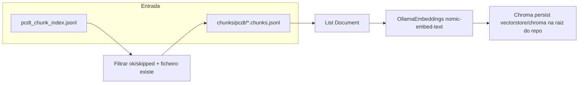

# Plano: Partes 2 e 3 — Embeddings locais e Chroma

## Contexto no repositório

- O roadmap em [`.cursor/plans/rag_+_fine-tuning_pipeline_d9c3a9a0.plan.md`](rag_+_fine-tuning_pipeline_d9c3a9a0.plan.md) marca Part 1 (chunking) como pendente no frontmatter, mas **`llm/src/pcdt_ingest/chunk.py`** já existe e grava `llm/data/chunks/pcdt/<stem>.chunks.jsonl` (linhas JSON com `text` + `metadata`: `source_stem`, `source_pdf`, `page_start`/`page_end`, `chunk_index`, etc.). O pré-requisito operacional para Parts 2–3 é ter corrido `chunk-pcdt` (ou equivalente) para produzir esses ficheiros.
- Não existe ainda `llm/src/pcdt_ingest/embed.py`; `llm/pyproject.toml` tem `langchain-core` e `langchain-text-splitters`, mas **falta** `chromadb`, `langchain-chroma`, `langchain-ollama`.
- **Localização do Chroma (decisão explícita):** persistir o vector store em **`vectorstore/chroma/` na raiz do repositório** (não sob `llm/data/`). Assim, `rm -rf llm/data` (repor PDFs, manifests, chunks regenerados) **não apaga** embeddings já calculados. Acrescentar `vectorstore/` ao `.gitignore` na raiz — o diretório não vai para o Git e fica só na máquina local.

## Ambiguidades resolvidas (decisões do projeto)

| Tópico | Decisão |
|--------|---------|
| Dependências | Lista **principal** em `[project.dependencies]` (um único `pip install -e .` desde `llm/`) |
| Fonte de chunks | Manifesto `llm/data/manifests/pcdt_chunk_index.jsonl`: incluir linhas com **`status` ∈ {`ok`, `skipped`}** e **ficheiro** `chunks_jsonl_relative_path` **existente** (validação no disco; `skipped` pode ter `chunk_count: 0` na linha mas ficheiro antigo válido) |

**Nota:** Excluir `error` e caminhos em falta. Se o ficheiro existir mas estiver vazio, tratar como zero documentos (log + skip).

## Arquitetura alvo

## 1. Dependências

Em `llm/pyproject.toml`, acrescentar versões mínimas alinhadas ao roadmap (ex.: `chromadb>=0.6`, `langchain-chroma>=0.1`, `langchain-ollama>=0.2`). Não é obrigatório o meta-pacote `langchain` se `langchain-chroma` + `langchain-core` forem suficientes para `Chroma` e `Document` — seguir o que o import real exigir após instalação.

## 2. Constantes de caminho e `.gitignore`

Em `llm/src/pcdt_ingest/paths.py`:

- Função dedicada, por exemplo `vectorstore_chroma_dir() -> Path`, que devolve **`find_repo_root() / "vectorstore" / "chroma"`** (segmentos relativos à raiz do Git, não a `llm/data`).
- **Não** acrescentar este diretório a `DATA_SUBDIRS` / `ensure_data_dirs()` — o vector store não é “dados de ingestão” ao lado de `raw/`; criar o diretório no arranque do CLI `build-vectorstore` ou na primeira abertura do `Chroma` (`mkdir(parents=True)`).

Persistência: `persist_directory=str(vectorstore_chroma_dir())`, `collection_name="pcdt"` (ou constante única reutilizável na Part 4).

No `.gitignore` **na raiz do repositório**, adicionar uma linha `vectorstore/` (ou equivalente explícito) para não versionar o conteúdo binário/persistente do Chroma.

**Documentar no README** (quando for atualizado) que o vector store fica na raiz por design, para sobreviver a limpezas de `llm/data`.

## 3. Módulo `embed.py`

**Responsabilidades:**

1. **Embeddings (Parte 2):** Instanciar `OllamaEmbeddings` de `langchain_ollama` com `model="nomic-embed-text"` e `base_url` configurável (default `http://127.0.0.1:11434` ou `localhost`, coerente com o roadmap). Opcional: ler `OLLAMA_BASE_URL` do ambiente para não hardcodar em testes/CI.
2. **Vector store (Parte 3):** Instanciar `Chroma` de `langchain_chroma` com `embedding_function`, `collection_name`, `persist_directory`.
3. **Leitura de chunks:** Função que lê um `.chunks.jsonl` (mesmo formato que `write_chunks_jsonl` em `chunk.py` grava) e devolve `list[Document]` com metadata já presente.
4. **IDs estáveis:** Para cada chunk, `id = f"{source_stem}:{chunk_index}"` (ambos já existem em `metadata`) — garante reexecuções idempotentes por documento.
5. **Deduplicação por ficheiro fonte (requisito do roadmap):** Antes de ingerir os documentos de um `source_stem`, **remover** da coleção entradas com esse `source_stem` no metadata (API Chroma: `delete` com filtro `where` em metadata; confirmar sintaxe na versão de `chromadb` instalada). Depois `add_documents` em **lotes** (ex.: 50–100 docs) para reduzir pressão no servidor Ollama e memória, como notado em “Potential inefficiencies” do roadmap mestre.

**Comentários inline:** Métodos com mais de ~15 linhas (ex.: loop de ingestão com delete + batches) devem ter comentários de secção, conforme regras do projeto.

## 4. CLI `build-vectorstore`

- Registar em `[project.scripts]`: `build-vectorstore = "pcdt_ingest.cli_embed:main"` (novo ficheiro `llm/src/pcdt_ingest/cli_embed.py`).
- Padrão semelhante a `cli_chunk.py`: `configure_logging`, `--force` (re-embed obrigatório para todos os stems selecionados, ignorando manifesto de embed e `chunks_mtime_unix`), `--max-files`, `--workers` com **cuidado** (Ollama/Chroma: default **1**; se no futuro `workers > 1`, exige bloqueio ou confirmação — nesta entrega pode limitar a 1 com aviso).
- Fonte de lista: ler `MANIFEST_PCDT_CHUNK`, filtrar `ok`/`skipped`, resolver caminho com `data_root()`, verificar `is_file()`.

## 4.1 Manifesto de embed (`pcdt_embed_index.jsonl`)

| Campo | Descrição |
|-------|-----------|
| **Caminho** | `llm/data/manifests/pcdt_embed_index.jsonl` (constante `MANIFEST_PCDT_EMBED` em `paths.py`, ao lado dos outros manifestos). |
| **Semântica de escrita** | **Merge por execução:** no fim de cada corrida do `build-vectorstore`, lê-se o ficheiro existente (se houver), atualizam-se **apenas** as linhas cujo `source_stem` foi processado nesta corrida, e reescreve-se o JSONL completo (ordem estável, ex. ordenada por `source_stem`). Assim não se perdem stems que não entraram em `--max-files` nem entradas antigas fora do conjunto filtrado. |
| **Campos por linha** | `source_stem` (str), `chunks_jsonl_relative_path` (str, relativo a `llm/data/`, igual ao conceito do manifesto de chunk), `embedded_count` (int), `status` (`embedded` \| `skipped_empty` \| `error`), `embedded_at` (ISO-8601), `chunks_mtime_unix` (float, `st_mtime` do ficheiro `.chunks.jsonl` após leitura — para decisão incremental). |
| **Incremental (sem `--force`)** | Para cada candidato, se existir linha no manifesto de embed com o mesmo `source_stem`, `status == embedded` ou `skipped_empty`, e `chunks_mtime_unix` igual ao `st_mtime` atual do ficheiro de chunks, **omitir** re-embed desse stem. Com `--force`, ignorar esta regra e voltar a ingerir sempre. |
| **Opt-out** | Flag `--skip-embed-manifest` no CLI: não lê nem grava `pcdt_embed_index.jsonl` (útil para debug; sem isso o incremental não funciona na corrida seguinte). |

## 5. Documentação mínima

- Em `llm/README.md` (se já documenta o pipeline): um parágrafo em pt-BR com `ollama pull nomic-embed-text` e exemplo `build-vectorstore`. **Só editar se o README já for o sítio natural** — evitar criar docs novos sem necessidade.

## 6. Testes

- Teste unitário leve: função de filtro do manifesto + parsing de uma linha JSONL de chunk (fixture mínima), **sem** subir Ollama (mock de `Chroma`/`OllamaEmbeddings` ou apenas funções puras). Evitar teste de integração que exija daemon local no CI, salvo opt-in marcado.

## Riscos / verificação manual

- Confirmar na doc da versão instalada que `Chroma.delete(where=...)` aceita o operador para `source_stem` (string).
- Dimensão do embedding de `nomic-embed-text` deve ser consistente numa mesma coleção; não misturar outro modelo na mesma `collection_name` sem `reset`.

## Ineficiências e otimizações (fim do plano)

- **Batching:** `add_documents` em lotes e, se a API permitir, evitar re-chamar embed para o mesmo texto (não aplicável na primeira ingestão).
- **Paralelismo:** Muitos workers contra Ollama podem degradar ou falhar; default conservador (ex.: 1–2).
- **Alternativa PT-BR:** O roadmap cita `BAAI/bge-m3` com `sentence-transformers` — **fora do escopo** destas duas partes; se a recall for má, avaliar troca numa iteração futura (novas dependências pesadas).
- **YAML do plano mestre:** Após implementação, atualizar o frontmatter/todos do ficheiro `rag_+_fine-tuning_pipeline_d9c3a9a0.plan.md` para refletir `embed` completo e corrigir o estado de `chunk` se for política do projeto — **opcional**.

## Follow-up: script de limpeza de dados (pipeline)

**Objetivo:** evitar `rm -rf` ad hoc; oferecer um CLI (ex.: `clean-pcdt-data` / `clean-llm-data` em `llm/`) que mapeia as pastas do pipeline e pede confirmação explícita nas operações destrutivas.

| Requisito | Detalhe |
|-----------|---------|
| **`llm/data` inteiro** | Só apagar **tudo** sob `llm/data/` com **flag explícita obrigatória** (ex.: `--all-llm-data` ou `--i-understand-delete-all-llm-data`). Sem essa flag, nunca remover a árvore completa. |
| **Granular** | Flags para partes do pipeline (evoluir com o repo): ex. `--raw-pcdt`, `--processed-pcdt`, `--chunks`, `--manifests`, `--clinical-exams`, `--sft-samples` — cada uma remove só o subdiretório/artefactos correspondentes em `llm/data/`. |
| **`vectorstore/`** | Opção **separada** (ex.: `--vectorstore` / `--chroma`) porque está **fora** de `llm/data/`; limpar Chroma não deve ser efeito colateral de limpar chunks/processed. |
| **UX segura** | Modo `--dry-run` (listar caminhos que seriam removidos) e/ou confirmação interativa quando várias flags destrutivas; mensagens em pt-BR nos textos ao utilizador. |
| **Implementação** | Novo módulo CLI em `llm/src/pcdt_ingest/` + entrada em `[project.scripts]`; usar `paths.py` (`data_root()`, `find_repo_root()`, `vectorstore_chroma_dir()` quando existir). |

Isto é **independente** da entrega mínima de `embed.py`, mas deve seguir a mesma convenção de caminhos (vectorstore na raiz do repo).
