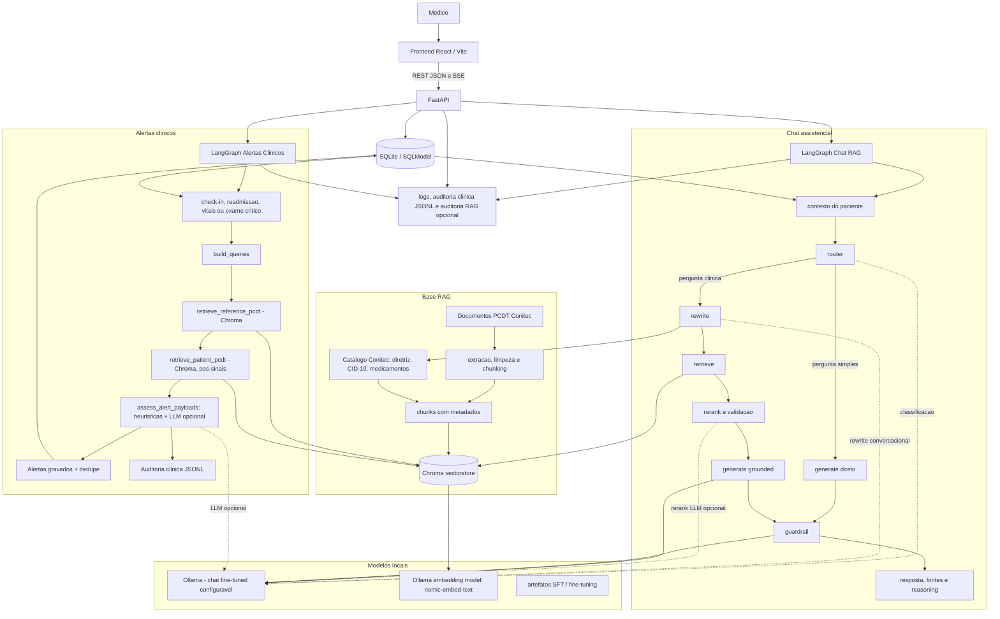
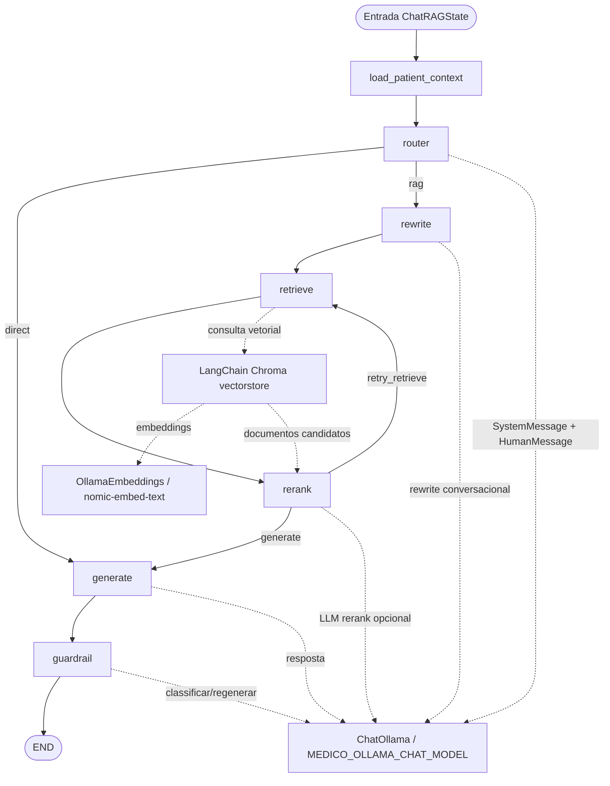
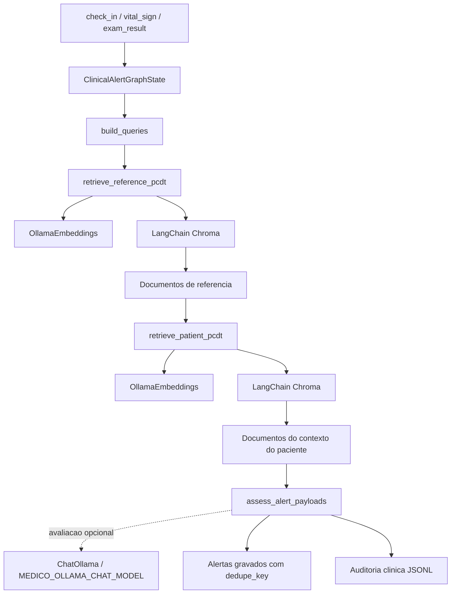
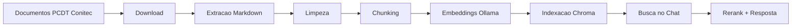

# Assistente Medico IA


Este projeto implementa uma solução de assistente virtual medico para apoio a decisao clinica em ambiente hospitalar, combinando FastAPI, LangGraph, LangChain, RAG sobre PCDTs da Conitec, contexto estruturado de paciente, alertas clinicos automatizados e guardrails de seguranca clinica.

Vídeo de apresentação: https://youtu.be/oVQ0AvYr8yw
Relatório de implementação: [docs/relatorio de implementação.md](./docs/relatorio%20de%20implementação.md)

## Nosso Grupo - Grupo 12
* Ana Paula Rodrigues Pereira (RM 369663) - aninha-felicio@hotmail.com
* Debora Priscila de Oliveira (RM 370133) - deborapoh@gmail.com
* Leander Seefeld (RM 370115) - leanseefeld@gmail.com
* Nurielly Caroline Brizola (RM 370109) - nurycaroline@gmail.com


## Visao Geral

Hospitais operam com protocolos extensos, documentos em PDF e dados clinicos dispersos. Na pratica, consultar criterios de inclusao, exames, condutas e contraindicações durante o atendimento consome tempo e aumenta o risco de resposta sem rastreabilidade.

Este projeto implementa um assistente medico com RAG + LangGraph + validacao + explicabilidade. A entrega cobre dois fluxos principais: chat clinico contextualizado e avaliacao automatizada de alertas clinicos baseada em dados do paciente, sinais/exames e trechos PCDT recuperados.

- responde perguntas clinicas em portugues com contexto de paciente quando informado;
- recupera trechos de PCDTs indexados em Chroma;
- expande e estrutura consultas com catalogo Conitec, CID-10 e entidades clinicas;
- reordena e valida documentos antes de gerar a resposta;
- avalia eventos de check-in, readmissao, sinais vitais e exames para gerar alertas deduplicados;
- cita fontes recuperadas e expoe etapas de raciocinio operacional;
- aplica guardrail clinico para doses, posologia e respostas inseguras;
- registra auditoria clinica e tecnica em logs estruturados.

## Execucao Local Completa

O projeto pode ser executado de duas formas: pelo orquestrador `run-local.py`, recomendado para a avaliacao, ou manualmente por modulo. O orquestrador automatiza instalacao, migrations, seed, variaveis basicas e subida dos servicos.

### 1. Preparar dependencias externas

### Pre-requisitos

- Python 3.11+.
- Node.js 22.x e npm.
- Ollama instalado e em execucao.
- Com o Ollama aberto, baixe os modelos usados pelo runtime local:

```bash
# Modelo treinado com conversas tidas no assistente
ollama pull hf.co/leanseefeld/assistente-medico-llama32-3b-q4km:Q4_K_M

# ou use llama3.2 diretamente, sem o fine tuning
# ollama pull llama3.2

# Modelo usado para gerar e buscar embeddings Chroma
ollama pull nomic-embed-text
```

### 2. Adicionar base de dados vetorial local

Na raiz do repositorio, adicione a base vetorial já populada com os PCDTs, disponível em [vectorstore/chroma/](https://drive.google.com/file/d/1mEDyTzbWI4nWjXp4xCXWzfTptb0KuaGE/view?usp=drive_link)

### 3. Subir aplicacao com setup automatico

Na raiz do repositorio:

```bash
python run-local.py --setup
```

Esse comando:

- cria `.venv` caso nao exista;
- instala os pacotes Python `llm` e `backend` em modo editavel;
- instala dependencias Node do `frontend`;
- baixa o modelo `pt_core_news_sm` usado pelo medSpaCy;
- cria `backend/.env` a partir de `backend/.env.example`;
- aplica migrations Alembic;
- executa o seed de pacientes sinteticos;
- sobe o backend em `http://localhost:8000/docs`;
- sobe o frontend em `http://localhost:5173`.

### 4. Executar com RAG completo

Se o diretorio `vectorstore/chroma/` ja existir e estiver populado, o backend usa esse indice automaticamente. Para reconstruir o indice Chroma a partir dos PCDTs:

```bash
python3 run-local.py --setup --setup-semantic --build-vectorstore
```

A reconstrucao executa a pipeline PCDT completa: download, catalogo Conitec, extracao Markdown, limpeza, chunking e indexacao Chroma com `nomic-embed-text`.

Opcoes uteis:

```bash
python3 run-local.py --backend-port 8001 --frontend-port 5174
python3 run-local.py --setup --setup-semantic
python3 run-local.py --build-vectorstore --chunk-strategy semantic
python3 run-local.py --build-vectorstore --chunk-tokens 500 --overlap-tokens 80
python3 run-local.py --skip-migrations
```

### 5. Validar rapidamente

Depois da subida:

- API interativa: `http://localhost:8000/docs`
- Frontend: `http://localhost:5173`
- Chamada de chat: `POST /api/assistant/chat`
- Painel de alertas no frontend: pagina `Alertas`
- Rotas de alertas na API: `GET /api/alerts`, `GET /api/alerts/unresolved-count`, `PATCH /api/alerts/{id}`
- RAG Inspector: `cd llm && streamlit run scripts/rag_inspector_app.py`

Perguntas para avaliacao:

```text
Quais sao os criterios de inclusao para SGB?
Como reconhecer lupus infantil?
O que o PCDT fala sobre E27.1?
Quais exames pendentes deste paciente?
Tratamento com hidrocortisona
```

As respostas dependem do indice Chroma local e do modelo Ollama disponivel. Quando o contexto e insuficiente ou incompatível, o fluxo deve responder de forma controlada em vez de inventar conteudo clinico.

Exemplo de chamada JSON:

```bash
curl -N \
  -H "Content-Type: application/json" \
  -H "Accept: application/json" \
  -H "X-User-Id: demo-doctor" \
  -d '{"patientId":"mock-adm-01","message":"Quais sao os criterios de inclusao para SGB?"}' \
  http://localhost:8000/api/assistant/chat
```

## Arquitetura



Componentes principais:

- `frontend/`: SPA React com paginas de dashboard, chat, exames, prescricoes e alertas.
- `backend/`: API FastAPI, persistencia, endpoints clinicos, grafos LangGraph e auditoria.
- `llm/`: pipeline de ingestao PCDT, limpeza, chunking, embeddings, Chroma, inspector e artefatos SFT.
- `vectorstore/chroma/`: indice Chroma local persistente, gerado pela pipeline.
- `logs/`: auditoria clinica e logs locais.

## Fluxos LangChain

O projeto usa LangChain como camada de integracao para mensagens, documentos, embeddings Ollama e Chroma. A orquestracao de estado e decisoes fica no LangGraph; os objetos e integrações LangChain aparecem nos nós de rewrite, retrieve, rerank, geração, guardrail, inspector e ingestão.

### Chat RAG



### Alertas Clinicos




## Documentacao do Projeto

Este README da raiz e a referencia canônica para avaliacao da entrega e para entender a arquitetura integrada. Os READMEs e documentos de modulo detalham partes especificas do sistema; alguns deles preservam contexto historico de desenvolvimento e, quando houver divergencia, este README prioriza o comportamento observado no codigo atual.

| Documento | Papel | Observacao                                                             |
| --- | --- |------------------------------------------------------------------------|
| [README.md](README.md) | Visao integrada do produto, arquitetura, execucao local e limites clinicos. | Fonte principal para banca e avaliacao geral.                          |
| [llm/fine-tuning/README.md](llm/fine-tuning/README.md) | Visão geral do processo de ajuste do modelo | Fonte principal para banca e avaliacao geral.                          |
| [backend/README.md](backend/README.md) | Detalha API FastAPI, endpoints do chat, variaveis, auditoria, grafo RAG e SQLite. | Referencia operacional do backend; este README da raiz consolida a arquitetura integrada. |
| [llm/README.md](llm/README.md) | Documenta a pipeline de ingestao PCDT, catalogo Conitec, limpeza, chunking, Chroma, RAG Inspector e dataset Einstein. | Principal referencia para reconstruir `llm/data/` e `vectorstore/chroma/`. |
| [frontend/README.md](frontend/README.md) | Explica requisitos Node, scripts Vite, build, preview, Docker e estrutura da UI. |  |
| [logs/README.md](logs/README.md) | Explica a pasta de logs e os arquivos `audit_clinical_YYYY-MM-DD.jsonl`. |                   |
| [docs/pipeline-rag.md](docs/pipeline-rag.md) | Referencia tecnica do pipeline RAG, dados tabulares e SFT. | Documento de arquitetura/implementacao; util para entender decisoes de ingestao e dados sensiveis. |
| [docs/langgraph-overview.md](docs/langgraph-overview.md) | Registro conceitual inicial sobre agente medico com LangGraph. | Nao representa integralmente o runtime atual; use como historico de ideacao. |
| [docs/referencia-frontend.md](docs/referencia-frontend.md) | Documento de referencia para a UI e fluxos de tela. | Tem trechos baseados em mock; a implementacao atual deve ser conferida em `frontend/src/`. |
| [docs/dev-log/](docs/dev-log/) | Decisoes e notas de desenvolvimento. | Inclui decisoes como streaming SSE com eventos LangGraph.              |

> **Observação sobre as documentações do projeto**
>
> O `README.md` da raiz deve ser considerado a documentação principal e mais atualizada para execução, arquitetura e avaliação do projeto.
>
> Os demais documentos mantidos no repositório podem conter trechos desatualizados, dependências que não fazem mais parte do fluxo atual ou uma organização que reflete etapas anteriores da evolução da solução. Optamos por preservá-los como registros históricos e técnicos do processo de construção do projeto, pois eles documentam decisões, experimentos, alternativas avaliadas e aprendizados acumulados ao longo da fase.
>
> Essa escolha não representa falta de revisão, mas sim a intenção de manter rastreável a trajetória de desenvolvimento: desde as primeiras hipóteses de ingestão, RAG, fine-tuning e fluxos LangGraph até a arquitetura atual consolidada. :)

## Fluxo da IA

### Chat

O grafo real do chat fica em `backend/src/assistente_medico_api/graph/chat_rag.py`:

```text
load_patient_context
-> router
   -> generate -> guardrail
   -> rewrite -> retrieve -> rerank
      -> generate -> guardrail
      -> retrieve -> rerank
         -> generate -> guardrail
```

Etapas:

- **load_patient_context**: busca no SQLite o contexto do paciente informado: dados demograficos, CID, sintomas, observacoes, medicamentos, comorbidades, exames recentes e acoes sugeridas.
- **router**: decide se a pergunta precisa de busca RAG. Perguntas clinicas e follow-ups clinicos tendem a seguir para busca.
- **rewrite**: transforma a pergunta em consulta autocontida, usa historico quando existir e expande termos com catalogo Conitec, CID-10 e resolvedor clinico.
- **retrieve**: consulta o Chroma com embeddings Ollama e retorna candidatos com metadados.
- **rerank**: filtra, reordena e classifica o contexto como `sufficient`, `partial` ou `insufficient`. Pode tentar nova recuperacao ate `MEDICO_RAG_MAX_RETRIEVE_ATTEMPTS`.
- **generate**: monta prompt com system prompt, historico, contexto do paciente e trechos PCDT; gera resposta pelo modelo de chat Ollama.
- **guardrail**: audita a resposta, adiciona aviso, regenera ou bloqueia conteudo clinicamente inseguro.

Exemplo de pergunta:

```text
Quais sao os criterios de inclusao para SGB?
```

Com indice PCDT disponivel, o fluxo esperado e: router marca RAG, rewrite expande SGB para a diretriz/candidato correspondente, retrieve busca no Chroma, rerank prioriza secoes de criterios, generate responde com citacoes `[n]`, guardrail classifica a seguranca.

### Alertas Clinicos

O backend tambem compila um segundo grafo LangGraph em `backend/src/assistente_medico_api/graph/clinical_alerts.py`. Ele e acionado por eventos clinicos persistidos nas rotas de pacientes:

- `check_in`: admissao ou readmissao de paciente;
- `vital_sign`: atualizacao de sinais vitais;
- `exam_result`: resultado de exame concluido ou marcado como critico.

O servico `clinical_alert_service.evaluate_clinical_alerts` monta um bundle do paciente, invoca o grafo e persiste alertas em SQLite via `alert_service`, usando `dedupe_key` para evitar repeticao de alertas nao resolvidos. O fluxo executa:

1. `build_queries`: monta consultas inicial e contextual a partir de CID, sintomas, medicamentos, comorbidades, sinais vitais ou exame.
2. `retrieve_reference_pcdt`: recupera trechos PCDT de referencia no Chroma.
3. `retrieve_patient_pcdt`: faz segunda recuperacao no Chroma com contexto do paciente e sinais interpretados.
4. `assess_alert_payloads`: aplica heuristicas, usa o contexto recuperado e, quando habilitado, faz avaliacao LLM opcional (`MEDICO_CLINICAL_ALERTS_USE_LLM`) para preparar alertas.

O resultado tambem gera auditoria clinica com `avaliacao_alerta_clinico_pcdt`.

## Pipeline RAG



Artefatos gerados:

| Etapa | Comando | Saida |
| --- | --- | --- |
| Download PCDT | `download-pcdt` | `llm/data/raw/pcdt/`, `llm/data/manifests/pcdt_index.jsonl` |
| Catalogo Conitec | `build-conitec-catalog` | `llm/data/processed/conitec/pcdt_catalog.jsonl` |
| Extracao | `extract-pcdt-markdown` | `llm/data/processed/pcdt/*.pages.jsonl` |
| Limpeza | `clean-pcdt-extracted` | `llm/data/processed/pcdt_cleaned/*.pages.cleaned.jsonl` |
| Chunking | `chunk-pcdt` | `llm/data/chunks/pcdt/*.chunks.jsonl` |
| Indexacao | `build-vectorstore` | `vectorstore/chroma/` |

Reconstrucao completa do indice:

```bash
python3 -m venv .venv
source .venv/bin/activate
pip install -e llm
ollama pull nomic-embed-text

download-pcdt --force
build-conitec-catalog
extract-pcdt-markdown --workers 6 --force
clean-pcdt-extracted --workers 6 --force
chunk-pcdt --workers 6 --force
build-vectorstore --force --verbose
```

Chunking semantico:

```bash
pip install -e "llm[semantic]"
chunk-pcdt --force --chunk-strategy semantic --chunk-tokens 500 --overlap-tokens 80
build-vectorstore --force
```

Visualizacao dos chunks:

```bash
cd llm
view-pcdt-chunks
```

RAG Inspector:

```bash
cd llm
streamlit run scripts/rag_inspector_app.py
streamlit run scripts/rag_inspector_app.py -- --export-audit /tmp/rag-audit.json
```

## Dataset

O projeto trabalha com fontes documentais, dados estruturados sinteticos e artefatos de treino/avaliacao:

| Tipo | Origem | Uso |
| --- | --- | --- |
| PCDT | Pagina publica de Protocolos Clinicos e Diretrizes Terapeuticas da Conitec | Base documental do RAG. |
| Catalogo Conitec | Planilha/catalogo processado pela pipeline | Enriquecimento de doença, diretriz, CID-10, medicamentos e portarias. |
| Pacientes de demo | Seed sintetico em `backend/scripts/seed_patients.py` | Demonstracao de contexto clinico estruturado. |
| Conversas SFT | Exportacao de feedback positivo e anonimizacao em `llm/scripts/sft_*.py` | Artefatos usados na trilha de fine-tuning do modelo de chat. |

Exemplo sintetico de paciente seedado:

```json
{
  "id": "mock-adm-01",
  "status": "admitted",
  "cid_code": "J45.9",
  "cid_label": "Asma nao especificada",
  "symptoms": "Dispneia\nSibilancia",
  "comorbidities": ["Asma"],
  "current_medications": ["Salbutamol"]
}
```

Anonimizacao:

- scripts de SFT pseudonimizam IDs e substituem CPF, telefone, e-mail e CEP por valores sinteticos estaveis;
- blocos PCDT sao protegidos para evitar mascarar termos clinicos como se fossem PII;
- o README nao inclui dado real de paciente.

## Stack Tecnologica

| Area | Tecnologias |
| --- | --- |
| Backend | Python 3.11+, FastAPI, Pydantic Settings, SQLModel, Alembic, aiosqlite |
| IA / Orquestracao | LangGraph, LangChain Core, LangChain Ollama |
| RAG | Chroma, LangChain Chroma, embeddings Ollama, catalogo Conitec, rerank heuristico |
| LLM | Ollama local; modelo fine-tuned configurado: `hf.co/leanseefeld/assistente-medico-llama32-3b-q4km:Q4_K_M`; embeddings: `nomic-embed-text` |
| Frontend | React 19, Vite, TypeScript, Tailwind, lucide-react, React Router |
| Observabilidade | logs Python, auditoria clinica JSONL, auditoria RAG opcional, RAG Inspector Streamlit |
| Testes | pytest, pytest-asyncio, testes de contrato de endpoints e pipeline |
| Persistencia | SQLite local, Chroma persistente em disco |

## Modulos

### Backend FastAPI

O modulo `backend/` concentra a API HTTP, persistencia relacional, grafos LangGraph e observabilidade. O startup da aplicacao (`assistente_medico_api.main`) inicializa embeddings Ollama, abre o Chroma, compila o grafo de chat, compila o grafo de alertas clinicos e registra auditoria de inicializacao.

Responsabilidades principais:

- rotas REST/SSE em `backend/src/assistente_medico_api/api/`;
- modelos SQLModel em `models/`;
- repositorios em `repositories/`;
- servicos de aplicacao em `services/`;
- grafo RAG e alertas em `graph/`;
- middleware, auditoria e logging em `observability/`;
- migrations Alembic em `backend/alembic/`;
- seed sintetico em `backend/scripts/seed_patients.py`.

O `backend/README.md` aprofunda endpoints, variaveis, logging, SQLite e detalhes do grafo RAG. Este README da raiz consolida a arquitetura integrada e o modelo fine-tuned usado na entrega.

### LLM, Ingestao e RAG

O modulo `llm/` e um pacote Python instalavel (`assistente-medico-llm`) que fornece CLIs para construir a base RAG:

- `download-pcdt`: baixa documentos da tabela PCDT da Conitec;
- `build-conitec-catalog`: gera catalogo local com diretriz, CID-10, medicamentos e portarias;
- `extract-pcdt-markdown`: converte PDFs para sidecars JSONL por pagina;
- `clean-pcdt-extracted`: remove ruido comum da extracao de PDFs;
- `chunk-pcdt`: gera chunks com metadados clinicos e de origem;
- `build-vectorstore`: indexa chunks no Chroma com embeddings Ollama;
- `view-pcdt-chunks`: abre visualizador HTML estatico de chunks;

O `llm/README.md` e a referencia detalhada para reconstruir `llm/data/`, `vectorstore/chroma/`, usar chunking semantico, operar o RAG Inspector e entender os artefatos de fine-tuning/SFT.

### Frontend React

O modulo `frontend/` implementa a UI em React + Vite. A aplicacao usa `VITE_API_BASE_URL` para falar com o backend e injeta `X-User-Id` a partir da sessao fake do medico. O chat consome SSE por `frontend/src/api/sseChat.ts`, agregando tokens, fontes, reasoning, guardrail e evento final.

Responsabilidades principais:

- layout e navegacao em `src/layouts/` e `src/components/`;
- paginas de check-in, dashboard, chat, exames, prescricoes e alertas em `src/pages/`;
- wrappers HTTP por dominio em `src/api/clinicalApi.*.http.ts`;
- tipos de dominio em `src/types/`;
- build Vite/TypeScript via `npm run build`.

O `frontend/README.md` documenta scripts Node, Docker e estrutura basica. Para comportamento atual de integracao, consulte tambem `frontend/src/api/clinicalApi.ts`.

### Logs e Auditoria

O diretorio `logs/` armazena auditoria clinica local em JSONL. Cada linha representa um evento clinico ou marco operacional do assistente, com campos como acao, medico, paciente, descricao, detalhes e request id. O `logs/README.md` explica a convencao `audit_clinical_YYYY-MM-DD.jsonl` e a relacao com os testes.

## Estrutura do Repositorio

```text
.
├── backend/
│   ├── alembic/                 # migrations do SQLite
│   ├── scripts/seed_patients.py # seed sintetico de demonstracao
│   ├── src/assistente_medico_api/
│   │   ├── api/                 # rotas FastAPI
│   │   ├── graph/               # grafos LangGraph e nos RAG/alertas
│   │   ├── models/              # modelos SQLModel
│   │   ├── observability/       # logs, auditoria e contexto de request
│   │   ├── repositories/        # acesso a dados
│   │   ├── schemas/             # contratos Pydantic
│   │   └── services/            # regras de aplicacao
│   └── tests/
├── frontend/
│   ├── src/api/                 # cliente HTTP/SSE
│   ├── src/components/          # componentes de UI
│   ├── src/pages/               # paginas clinicas
│   └── src/types/
├── llm/
│   ├── src/pcdt_ingest/         # pipeline PCDT e Chroma
│   ├── scripts/                 # inspector e utilitarios SFT
│   ├── fine-tuning/             # notebooks e datasets de fine-tuning
│   ├── tools/pcdt-chunks-viewer/
│   └── tests/
├── docs/
│   ├── assets/                  # imagens tecnicas existentes
│   ├── pipeline-rag.md
│   └── datasource_albert-einstein.md
├── logs/
├── vectorstore/chroma/          # indice local gerado
└── run-local.py                 # orquestrador local
```


### Variaveis de Ambiente

Variaveis efetivamente lidas pelo backend em `backend/src/assistente_medico_api/config.py`:

| Variavel | Default / exemplo | Descricao |
| --- | --- | --- |
| `MEDICO_OLLAMA_BASE_URL` | `http://127.0.0.1:11434` | URL do Ollama. |
| `MEDICO_OLLAMA_EMBED_MODEL` | `nomic-embed-text` | Modelo de embeddings. |
| `MEDICO_OLLAMA_CHAT_MODEL` | `hf.co/leanseefeld/assistente-medico-llama32-3b-q4km:Q4_K_M` | Modelo de chat fine-tuned servido pelo Ollama. |
| `MEDICO_CHROMA_PERSIST_DIR` | `vectorstore/chroma` | Diretorio Chroma; se omitido, usa o padrao da pipeline. |
| `MEDICO_CHROMA_COLLECTION` | `pcdt` | Colecao Chroma. |
| `MEDICO_RETRIEVAL_K` | `6` | Top-k legado de recuperacao. |
| `MEDICO_RAG_RETRIEVE_CANDIDATES_K` | `30` | Candidatos recuperados antes do rerank. |
| `MEDICO_RAG_RETRIEVE_FINAL_K` | `6` | Documentos finais enviados ao prompt. |
| `MEDICO_RAG_MAX_RETRIEVE_ATTEMPTS` | `2` | Tentativa inicial + fallback. |
| `MEDICO_RAG_USE_LLM_RERANK` | `false` | Habilita rerank por LLM com fallback heuristico. |
| `MEDICO_RAG_LLM_RERANK_TOP_N` | `12` | Candidatos enviados ao LLM reranker. |
| `MEDICO_RAG_USE_CROSS_ENCODER_RERANK` | `false` | Habilita CrossEncoder opcional. |
| `MEDICO_RAG_CROSS_ENCODER_MODEL` | `cross-encoder/ms-marco-MiniLM-L-6-v2` | Modelo CrossEncoder. |
| `MEDICO_RAG_CROSS_ENCODER_TOP_N` | `15` | Top-N enviado ao CrossEncoder. |
| `MEDICO_RAG_MIN_FINAL_SCORE` | `-5.0` | Score minimo geral. |
| `MEDICO_RAG_REQUIRE_CATALOG_MATCH_WHEN_CONFIDENT` | `true` | Restringe docs quando catalogo tem match confiavel. |
| `MEDICO_RAG_MIN_FINAL_SCORE_WITH_CATALOG` | `0.0` | Score minimo quando filtro de catalogo se aplica. |
| `MEDICO_RAG_REQUIRE_SOURCE_FOR_CLINICAL_ANSWER` | `true` | Evita resposta clinica grounded sem fonte validada. |
| `MEDICO_RAG_DEBUG` | `false` | Expõe diagnostico adicional. |
| `MEDICO_RAG_AUDIT_ENABLED` | `false` no codigo, `true` em `.env.example` | Grava auditoria RAG tecnica. |
| `MEDICO_RAG_AUDIT_JSONL` | `../llm/data/audit/rag_interactions.jsonl` | Arquivo da auditoria RAG. |
| `MEDICO_DATABASE_URL` | `sqlite+aiosqlite:///./assistente_medico.db` | Banco relacional local. |
| `MEDICO_UPLOADS_DIR` | `./uploads` | Uploads manuais de exames. |
| `MEDICO_LLM_STREAM_TIMEOUT_S` | `240.0` | Timeout de streaming LLM. |
| `MEDICO_LOG_DIR` | `./logs` | Diretorio de auditoria clinica. |
| `MEDICO_LOG_LEVEL` | `INFO` | Nivel dos loggers `assistente_medico.*`. |
| `MEDICO_CLINICAL_AUDIT_ENABLED` | `true` | Liga JSONL clinico diario. |
| `MEDICO_LLM_INTERACTION_LOG_ENABLED` | `false` | Persiste chamadas auxiliares ao LLM em `conversation_message_llm_calls`. |
| `MEDICO_CLINICAL_ALERTS_USE_LLM` | `true` | Permite segunda passagem LLM nos alertas clinicos. |
| `OLLAMA_BASE_URL` | `http://127.0.0.1:11434` | Usada pela pipeline `llm` de embeddings. |
| `VITE_API_BASE_URL` | `http://localhost:8000/api` | URL do backend usada pelo frontend. |


## Seguranca Clinica

O sistema implementa limites explicitos:

- nao substitui medico, protocolo oficial ou avaliacao multiprofissional;
- nao deve ser usado como prescricao automatica;
- alertas clinicos sao apoio operacional e exigem revisao da equipe responsavel antes de qualquer conduta;
- evita resposta clinica grounded sem contexto validado quando `MEDICO_RAG_REQUIRE_SOURCE_FOR_CLINICAL_ANSWER=true`;
- cita fontes PCDT recuperadas quando responde com RAG;
- registra reasoning operacional e fontes para rastreabilidade;
- classifica respostas por LLM auditor e fallback deterministico por regex;
- adiciona disclaimer quando ha dose/esquema numerico classificado como aviso;
- bloqueia ou regenera respostas com padrao prescritivo inseguro;
- mascara CPF em helpers de auditoria e usa truncamento para texto livre em logs.

Status de guardrail:

| Status | Comportamento |
| --- | --- |
| `safe` | Resposta entregue sem alteracao. |
| `warned` | Resposta entregue com aviso clinico adicional. |
| `regenerated` | Resposta original substituida por versao mais restritiva. |
| `blocked` | Resposta substituida por mensagem segura padrao. |

## Observabilidade

Recursos implementados:

- logs de aplicacao no namespace `assistente_medico.*`;
- `RequestContextMiddleware` com `X-Request-Id`, `X-User-Id` e contexto de auditoria;
- auditoria clinica diaria em `logs/audit_clinical_YYYY-MM-DD.jsonl`;
- auditoria da avaliacao de alertas clinicos PCDT, incluindo trigger, fontes resumidas e contagem de alertas emitidos/deduplicados;
- eventos de chat/RAG via `audit()`;
- auditoria RAG tecnica opcional em `MEDICO_RAG_AUDIT_JSONL`;
- persistencia opcional de chamadas auxiliares ao LLM em `conversation_message_llm_calls`;
- RAG Inspector com `memory_result`, `router_result`, `rewrite_result`, `retrieve_result`, `rerank_result`, fontes e `audit_trace`.

Leitura rapida dos ultimos eventos clinicos:

```bash
tail -n 5 logs/audit_clinical_$(date +%Y-%m-%d).jsonl
```

Depuracao de uma pergunta no inspector:

```bash
cd llm
streamlit run scripts/rag_inspector_app.py -- --export-audit /tmp/rag-audit.json
```

## Testes

Backend:

```bash
cd backend
source ../.venv/bin/activate
python3 -m pytest
python3 -m pytest tests/test_chat_endpoint_contract.py
python3 -m pytest -k "rag_pipeline"
```

LLM / ingestao:

```bash
cd llm
source ../.venv/bin/activate
python3 -m pytest
python3 -m pytest tests/test_chunk.py tests/test_embed.py
```

## Resultados

Beneficios implementados:

- consulta operacional a PCDTs com fontes rastreaveis;
- resposta contextualizada por dados estruturados do paciente;
- alertas clinicos deduplicados para check-in/readmissao, sinais vitais e exames criticos;
- separacao clara entre recuperacao, validacao, geracao e guardrail;
- logs clinicos e tecnicos suficientes para auditoria e depuracao;
- execucao local com modelos Ollama e banco SQLite;
- inspector para comparar backend e pipeline RAG.

Limitacoes atuais:

- qualidade da resposta depende do modelo Ollama configurado e da cobertura do indice;
- alertas dependem da qualidade dos dados estruturados registrados e do contexto recuperado no Chroma;
- o modelo fine-tuned precisa estar disponivel no Ollama local com o nome configurado em `MEDICO_OLLAMA_CHAT_MODEL`;
- Chroma precisa ser previamente construido para RAG completo;
- CrossEncoder e LLM rerank sao opcionais e desligados por padrao;

Tradeoffs:

- uso de Ollama facilita reproducibilidade local, mas limita desempenho ao hardware disponivel;
- SQLite simplifica avaliacao local, mas nao e o alvo natural de producao hospitalar;
- guardrail reduz risco de prescricao automatica, mas pode bloquear respostas que exigem revisao medica detalhada;
- rerank heuristico e explicavel por padrao; rerank neural fica opt-in por custo e dependencias.

## Roadmap

Implementado:

- API FastAPI com chat JSON e SSE;
- grafo LangGraph de chat RAG;
- grafo LangGraph de alertas clinicos;
- ingestao PCDT, limpeza, chunking e Chroma;
- contexto clinico estruturado de paciente;
- guardrail clinico;
- auditoria clinica JSONL;
- RAG Inspector;
- frontend React integrado ao backend;
- seed sintetico de pacientes;
- scripts de exportacao/anonimizacao para SFT;
- fine tuning do modelo com conversas exportadas.

Proximos passos possiveis:

- ampliar avaliacao quantitativa do modelo fine-tuned em perguntas clinicas e recuperacao RAG;
- adicionar avaliacao automatica de qualidade RAG;
- consolidar cobertura de testes e relatorio de cobertura;
- parametrizar deploy fora de ambiente local.
