Relatório de implementação do assistente.
Apresenta o raciocínio da equipe para abordar o problema e desenvolver a solução.

-----
# Interpretação Não-Técnica do Desafio

Para direcionar os trabalhos da equipe e arquitetar a solução, partimos para a criação de um protótipo da interface pela qual o médico irá interagir.

O problema pede uma plataforma que sirva como assistente médico, com um cadastro mínimo de pacientes e exames, além de uma integração com LLM para conversação e auxílio em atendimentos.

O usuário alvo é o médico que presta atendimento e se beneficiaria de consultas facilitadas em linguagem natural a protocolos de atendimento e uma base de conhecimento médico no geral.

A plataforma deve reagir a eventos no sistema que indiquem urgência no atendimento decorrentes de check-in de pacientes em situação grave, resultados anormais de exames ou alterações no quadro do paciente.

Utilizando IA, criamos as seguintes telas em um frontend React com dados simulados:

* **Check-in/Admissão**: é por onde pacientes entram no sistema e podem ser automaticamente analisados pelo assistente. Aqui deverão ser informados dados básicos como idade, sexo, comorbidades, podendo também serem informados sintomas, sinais vitais e medicamentos em uso para um melhor resultado. Aqui são cadastrados ou selecionados pacientes para as demais consultas.
* **Dashboard**: visão geral do paciente, com CID principal, últimos sinais vitais, exames pendentes, alertas e histórico.
* **Chat com Assistente**: principal componente de interação, irá expor a interação entre o médico e o assistente, com perguntas sugeridas, fontes consultadas pelo agente e o fluxo de raciocínio (como chegou na resposta e nas fontes).
* **Fluxo de decisão**: a ideia é mostrar o fluxo de decisão do agente logo após a admissão do paciente, indicando etapas como triagem, consulta de protocolos, checagem de exames pendentes, sugestão de ações e alertas emitidos.
* **Exames**: relação de exames realizados e pendentes para o paciente ativo.
* **Ações sugeridas**: apresenta um resumo do caso, gerado pelo assistente, e uma lista de ações sugeridas - que podem ser aceitas, rejeitadas ou aceitas com modificações. Deve, também, indicar as fontes que justifiquem as sugestões.
* **Alertas**: todos os registros vindos da API (`GET /api/alerts`), incluindo os emitidos pelo **pipeline backend de alertas clínicos** (PCDT/RAG — secção Backend) e notificações manuais/demo da própria interface; é possível focar no paciente, filtrar e marcar como resolvido.


# Dados para Fine Tuning e RAG

## Protocolos Clínicos

Para o corpus de protocolos clínicos, recorremos a [Comissão Nacional de Incorporação de Tecnologias no Sistema Único de Saúde (**CONITEC**)](https://www.gov.br/conitec/pt-br/assuntos/avaliacao-de-tecnologias-em-saude/protocolos-clinicos-e-diretrizes-terapeuticas#TopoPCDT), que publica uma série de Protocolos Clínicos e Diretrizes Terapêuticas (**PCDT**) orientando atendimentos, diagnósticos e tratamentos na rede pública de saúde do Brasil.
Estes protocolos são disponibilizados em formato PDF e em idioma Português.

Outros documentos auxiliares são disponibilizados nesta mesma fonte para auxiliar em tratamento oncológico e outras condições, mas optamos por começar apenas com uma categoria de documentos para testar a implementação e não sobrecarregar o ambiente de desenvolvimento local - afinal, os documentos precisam ser descarregados pela rede, processados e armazenados.

## Exames e Laudos laboratoriais

Para entender o formato de resultados laboratoriais e preparar o assistente para a sua interpretação, recorremos a base de [Dados COVID Hospital Israelita Albert Einstein](https://repositoriodatasharingfapesp.uspdigital.usp.br/handle/item/98).

Os dados já estão anonimizados, mas ainda é necessário um aceite aos termos de uso para descarregar e utilizar esta base.

Embora os exames desta base tenham sido solicitados no contexto de diagnóstico e acompanhamento de quadros de COVID-19, os exames são de natureza diversa e podem ajudar o modelo a generalizar bem para outras condições.

## Medicamentos essenciais (RENAME 2024)

Para a base de medicamentos utilizados no sistema, passamos a adotar como fonte oficial a **RENAME 2024** (Relação Nacional de Medicamentos Essenciais), mantida pelo **Ministério da Saúde** com apoio da **Conitec**.

A RENAME é a lista oficial dos medicamentos do SUS e será usada como referência primária para catálogo de medicamentos, padronização de nomenclatura e preenchimento assistido nos fluxos de admissão e atendimento.

## Pipeline de extração e preparo de documentos

Foi criado um utilitário em `/llm` para baixar e converter os PCDTs automaticamente. Este utilitário se comporta como um módulo isolado para as diferentes fases da pipeline.
Seus componentes e modo de usar são descritos no em [llm/README.md](../llm/README.md).

### Download dos datasets

```sh
download-pcdt # para os PDFs com os PCDTs da CONITEC/SUS
download-clinical-exams # para baixar ou extrair os exames para COVID do Albert Einstein
```

Estes utilitários carregam os datasets diretamente da internet, salvando para a pasta `llm/data/raw`.

Para os PCDTs, o HTML da página é carregado em Python e seletores CSS (ou operações equivalentes) são usados para selecionar os link do documento e seus títulos (primeiro `<table>` de conteúdo da página).

O dataset COVID requer aceite de termos e por isso um navegador é aberto automaticamente para que o usuário preencha os dados e faça o aceite. Do contrário, o utilitário também pode ser executado com o argumento `--zip caminho/do/dataset.zip` para usar o arquivo zip do dataset previamente baixado.

Para ambos os datasets, um arquivo `.jsonl` é criado em `llm/data/manifests` contendo URL de origem, SHA do arquivo baixado, nome salvo localmente, data de acesso e descrição da fonte (publicação e data).

### Conversão para Markdown

```sh
extract-pcdt-markdown
```

Através deste utilitário, usamos a lib `pymupdf4llm` para gerar conteúdo Markdown a partir dos PCDTs. Cada documento resulta em um `.pages.jsonl` em `llm/data/processed/pcdt` contendo a página original e seu conteúdo convertido para Markdown. Se executado com `--with-combined-md`, gera também um arquivo .md com todas as páginas concatenadas.

Um novo manifesto é gerado (`llm/data/manifests/pcdt_md_extract.jsonl`) para rastrear erros e permitir processar apenas novos documentos.

Nenhum tratamento adicional foi implementado para os documentos. O objetivo é entender como os documentos são gerados antes de implementar melhorias.

### Geração de chunks

```sh
chunk-pcdt
```

A geração de tokens usa `MarkdownHeaderTextSplitter` e `RecursiveCharacterTextSplitter` (quando se excede a estimativa de 800 tokens) para geração de chunks a partir dos arquivos gerados na etapa anterior. Há tratamento para indexar a seção e cabeçalhos prévios onde o conteúdo extraído aparece.

O resultado da execução são arquivos `.jsonl` para cada documento inicial, que são salvos em `llm/data/chunks`, e um novo `manifests/pcdt_chunk_index.jsonl` com um registro para cada documento PCDT.

Um visualizador de chunks foi implementado para facilitar a exploração dos resultados deste processo e realizar ajustes no algoritmo.

```sh
view-pcdt-chunks
```


Em primeiro momento, é possível perceber que uma estratégia melhor é necessária para capturar corretamente os cabeçalhos e seções relevantes.
Há também problemas em formatação de tabelas, especialmente quando a tabela é continuada em outra página.

Há conteúdo potencialmente redundante (como página inicial de cada documento, como declaração do órgão regulador - Ministério da Saúde) e referências que talvez não possamos usar adequadamente para fundamentar as respostas pois exigiria identificar suas chamadas no corpus e correlacionar com sua declaração na seção de referências do documento (geralmente ao fim).

### Embeddings em Vectorstore/Chroma

```sh
build-vectorstore
```

Aqui os chunks da etapa anterior são convertidos em embeddings com `OllamaEmbeddings` usando `nomic-embed-text`.

Durante os testes, alguns chunks excederam o limite de contexto deste modelo de embedding (8.192 tokens) e então o limite de chunk (`_CHUNK_TOKENS` em [chunks.py](../llm/src/pcdt_ingest/chunk.py)) foi reduzido de 800 para 400.
A mensagem de erro do Ollama não indicava o limite suportado ou quantos tokens seriam necessários para comportar o chunk que ocasionou o erro, e inspecionando o chunk culpado, não ficou evidente uma diferença significativa na quantidade de palavras.
Isso evidencia o desalinhamento entre a estimativa de tokens do módulo `chunks.py` em relação ao processo de tokenização com `nomic` usando linguagem complexa da medicina em Português Brasileiro.

**Recomendação:** substituir o motor de embedding por um que lide melhor com o vocabulário utilizado nos PCDTs.

Foi criado também um script para fazer a consulta dos documentos ingeridos: [example_vectorstore_rag_query.py](https://github.com/leanseefeld/8iadt-tc-fase3-assistente-medico/blob/9171d61704174b75abc8816912182d622a5b6ab0/llm/scripts/example_vectorstore_rag_query.py).
<!-- usando link para versão específica, tornando seguro excluir este arquivo -->

É necessário ter ingerido pelo menos um documento com o comando `build-vectorstore` para fazer o teste.
Neste script é feito uma busca simples, onde a query é convertida diretamente em embeddings e feito a busca no espaço vetorial. Isso resultou em chunks importantes não sendo retornados, mesmo com um k=10.

Na implementação real, é indicado aplicar uma otimização de consulta, que identique os documentos relevantes de antemão e inclua cabeçalhos do metadata (hoje, apenas o conteúdo textual do chunk é consultado).

# Backend

Precisamos de um serviço que irá executar nosso agente LangGraph e também para gerenciar operações CRUD do nosso EMR (Electronic Medical Records) - de cadastro de pacientes à registro de solicitações e resultados de exames.

A pasta `/backend/` passa assim a abrigar o `assistente_medico_api`- um projeto FastAPI encapsulado que pode ser executado com:

```bash
uvicorn assistente_medico_api.main:app --reload --host 0.0.0.0 --port 8000
```

Este serviço consome a `/vectorstore/chroma` criada pelo comando `build-embeddings` da seção anterior e usa o pacote `assistente-medico-llm` (`/llm`) para inicializar os embeddings com a mesma configuração em que foram gerados.

### Catálogo de CIDs

Para a listagem de CIDs utilizada no backend (endpoint `/api/cids`), passamos a usar o pacote [`simple-icd-10`](https://pypi.org/project/simple-icd-10/), que fornece a base de códigos e descrições ICD-10 em memória para o serviço.

## Auditoria em JSON (clínica e operação do RAG)

O backend registra eventos auditáveis de duas naturezas complementares: **ações clínicas e de uso do assistente**, em **JSONL**, e **telemetria operacional do RAG** no mesmo formato diário sempre que faz sentido institucional (enum unificado).

**Diário sob `logs/`** — cada dia gera **`audit_clinical_YYYY-MM-DD.jsonl`**; a escrita usa [`clinical_audit_jsonl.py`](../backend/src/assistente_medico_api/observability/clinical_audit_jsonl.py): função `clinical_audit(...)` em modo **append-only**, **thread-safe**, diretório configurável **`log_dir`** (por defeito `./logs`). Desliga-se com **`MEDICO_CLINICAL_AUDIT_ENABLED=false`** (`clinical_audit_enabled` em [`Settings`](../backend/src/assistente_medico_api/config.py)); o **`pytest`** define isso por defeito no **`conftest`** para não poluir disco durante os testes.

Cada linha é um objeto JSON típico com **`acao`** (valores definidos em [`ClinicalAuditAction`](../backend/src/assistente_medico_api/observability/clinical_audit_jsonl.py)), por exemplo: **`admissao_paciente`**, **`readmissao_paciente`**, **`alta_paciente`**, atualizações de CID, solicitações e alterações de exames (**`novo_exame`**, **`exame_alterado`**), vitais (**`sinal_vital_registrado`**), **`alerta_emitido`**, **`alerta_resolvido`**, **`avaliacao_alerta_clinico_pcdt`**, prescrições (**`prescricao_emitida`**, **`prescricao_arquivada`**), **`execucao_fluxo_decisao`**, bem como os códigos de **uso do assistente/RAG**: **`backend_assistente_iniciado`**, **`reescrita_consulta_rag`**, **`recuperacao_contexto_rag`**, **`geracao_resposta_rag`**, **`guardrail_avaliado`**, **`conversa_assistente_solicitada`**, **`conversa_assistente_finalizada`**. Quando faz sentido, seguem **`patient_id`** e **`patient_name`**, texto **`descricao`** e objeto **`detalhes`** livre (**`exam_id`**, **`trigger`**, contagens **`emitidos`/`pulados_deduplicacao`** no ciclo LangGraph dos alertas, trechos curtos das fontes, etc.), **`medico_id`** e **`request_id`** (derivados dos **ContextVars** da requisição se omitidos).

O cabeçalho **`X-Audit-Context: demo`** sinaliza simulações na UI (vitais/resultados apenas para protótipo). Quando **`audit_context_is_demo()`** é verdadeira, aparecem ações **`simulacao_resultado_exame`**, **`simulacao_sinal_vital`**, etc., conforme [`patients.py`](../backend/src/assistente_medico_api/api/patients.py).

**Fluxo só técnico** — **`rag_audit_enabled`** / **`MEDICO_RAG_AUDIT_ENABLED`** controlam registos **`audit(...)`** RAG (**[`audit.py`](../backend/src/assistente_medico_api/observability/audit.py)**, `kind` `rag`/subtipos no logger **`assistente_medico.audit.rag`**), habitualmente escritos também em **`logs/assistente_medico.jsonl`** mediante o formato JSON configurado no arranque. O **`audit_clinical_*.jsonl`** concentra o diário institucional (clínico + eventos compactos ligados ao RAG na mesma convenção quando aplicável). No console, o logger **`assistente_medico.alert_rag`** ajuda a depurar recuperações do grafo **`clinical_alert_graph`**.

Para **validar só o ciclo dos alertas PCDTs**, procure no ficheiro do dia linhas **`"acao":"avaliacao_alerta_clinico_pcdt"`**, em que **`descricao`** e **`detalhes`** já trazem o resumo (**`run_id`**, metadados de trace compactos) escritos pelo serviço [`clinical_alert_service.py`](../backend/src/assistente_medico_api/services/clinical_alert_service.py).

## LangGraph - Chat com Assistente

Em primeiro momento, criamos um LangGraph simples em [`assistente_medico_api/graph/chat_rag.py`](../backend/src/assistente_medico_api/graph/chat_rag.py) com um _retriever_ e um _generator_, recebendo uma mensagem do usuário e a usando diretamente para fazer a busca na base vetorizada.

```
+-----------+  
| __start__ |  
+-----------+  
      *        
      *        
      *        
+----------+   
| retrieve |   
+----------+   
      *        
      *        
      *        
+----------+   
| generate |   
+----------+   
      *        
      *        
      *        
 +---------+   
 | __end__ |   
 +---------+   
 ```

A geração de texto é feita com Ollama + Gemma4:e4b (8B de parâmetros) e o conteúdo buscado deixa muito a desejar. Neste momento ainda não é feito nenhum tipo de tratamento para os termos da busca e nem são usados os campos de metadados dos chunks para refinar o escopo. Há ainda a questão com possível baixa qualidade dos embeddings utilizados para nosso contexto.

Para facilitar os testes, integramos a aba "Chat com assistente" do nosso protótipo com a nova API, e pudemos verificar a geração adequada de respostas onde a busca foi bem sucedida, e resposta honesta do modelo quando não pôde responder perguntas - conforme orientação passada no _system prompt_ utilizado. Entregamos, também, a "linha de raciocínio" do agente (atualmente alimentada pelos nós, indicando a busca feita na base) e as fontes consultadas (obtidas diretamente do retorno da consulta Chroma).

Para reduzir o tempo de espera até a resposta ser gerada, executamos o grafo LangGraph de forma assíncrona (`graph.astream_events`) e capturamos eventos (`on_chain_end`, `on_chat_model_stream`) para enviar tokens para o cliente front-end conforme são gerados (cabeçalho `Accepts: text/event-stream`).


## Pipeline de alertas clínicos (LangGraph + PCDTs)

Além do grafo principal do chat, foi implementado um **segundo grafo LangGraph** dedicado a **triagem institucional** com base nos PCDTs indexados (`clinical_alert_graph`), compilado no `lifespan` da aplicação (`app.state.clinical_alert_graph`, ver [`main.py`](../backend/src/assistente_medico_api/main.py)). Ele reutiliza rewrite, recuperação em Chroma e rerank já usados pelo RAG, porém com **consultas próprias** do fluxo de alertas (duas recuperações aos documentos: referência inicial e refinamento após interpretação dos dados locais).

**Orquestração** — Estado e schemas em [`clinical_alert_state.py`](../backend/src/assistente_medico_api/graph/clinical_alert_state.py) e [`clinical_alert_schemas.py`](../backend/src/assistente_medico_api/graph/clinical_alert_schemas.py); nós modulares em [`graph/alert_nodes/`](../backend/src/assistente_medico_api/graph/alert_nodes/) (`build_query`, `retrieve`, `interpret`, `assess`); definição do grafo em [`clinical_alerts.py`](../backend/src/assistente_medico_api/graph/clinical_alerts.py). A avaliação e persistência ficam centralizadas em [`clinical_alert_service.py`](../backend/src/assistente_medico_api/services/clinical_alert_service.py), que só grava cada payload depois da checagem de duplicidade.

**Gatilhos** ([`patients.py`](../backend/src/assistente_medico_api/api/patients.py)):

* **check_in** — criação e readmissão de pacientes (bundles com sintomas, medicamentos, CID, etc.);
* **vital_sign** — `PATCH` de sinais vitais quando o fluxo chama avaliação de alertas sobre vitais atualizados;
* **exam_result** — `PATCH /api/patients/{id}/exams/{exam_id}` quando o corpo inclui **`result`** e/ou **`interpretation`** e/ou **`status`** ∈ `completed` \| `critical` (uso do flag `should_eval_alerts` no endpoint).

Decisões **heurísticas** incluem mensagens rápidas para limiares de vitais (`interpret.py`) e, opcionalmente, **`MEDICO_CLINICAL_ALERTS_USE_LLM`** ([`config.py`](../backend/src/assistente_medico_api/config.py)) para avaliação estruturada via LLM com trechos recuperados dos PCDTs. Sem LLM ou em paralelo, o fluxo pode gerar alerta moderado quando os trechos recuperados contêm palavras associadas à urgência ou à gravidade (lista pré-definida no interpretador), o que pode **combinar com** vitais já críticos e produzir **mais de um alerta** no mesmo `PATCH`. Exames com `status=critical` disparam também alerta próprio (“Resultado crítico registrado…”) em [`assess.py`](../backend/src/assistente_medico_api/graph/alert_nodes/assess.py).

Persistência segue [`alert_service.create_alert()`](../backend/src/assistente_medico_api/services/alert_service.py); foi adicionada coluna **`dedupe_key`** (migração Alembic `20260525_1800`, índice) e o repositório evita novo registro quando já há alerta não resolvido **com a mesma chave**. Nota importante: fingerprints de vitais rápidos incluem o **texto completo da mensagem** (ex.: percentual de SpO₂); dois valores diferentes geram duas linhas válidas até serem marcadas como resolvidas — a deduplicação suprime **PATCH idênticos** que gerariam a mesma mensagem, não agrupa diferentes leituras de SpO₂ no mesmo campo.

**Auditabilidade** — Ver **Auditoria em JSON**: uma linha por execução com **`acao`** = **`avaliacao_alerta_clinico_pcdt`** (**`clinical_audit`** em [`clinical_alert_service.py`](../backend/src/assistente_medico_api/services/clinical_alert_service.py)), com **`descricao`** (alertas emitidos versus saltados pela deduplicação) e **`detalhes`** (**`trigger`**, **`run_id`**, **`audit_trace_compacto`** com fontes resumidas). No console usa-se o logger **`assistente_medico.alert_rag`** nas recuperações do fluxo.

**Contrato frontend** — [`AlertsPage.tsx`](../frontend/src/pages/AlertsPage.tsx) lista via HTTP **todos** os alertas (lista global por design); o painel “Volume mock” continua apenas decorativo. Nem todo alerta vem do multigrafo: a página **Exames** pode usar “notificar responsável”, que cria alerta direto pela API sem o pipeline LangGraph dos PCDTs.

**Testes** — [`test_clinical_alert_graph.py`](../backend/tests/test_clinical_alert_graph.py) (smoke do grafo sem vector store / SpO₂ crítico) e [`test_clinical_alert_dedupe_integration.py`](../backend/tests/test_clinical_alert_dedupe_integration.py) (dois PATCH vitais **idênticos** ⇒ um só alerta SpO₂ crítico aberto). Resumo operacional também no [`README.md`](../README.md) (Alertas clínicos).

## Plano de extração dos nomes de medicamentos (RENAME)

Resumo do plano executável para o arquivo `docs/rename-medicamentos-2024.pdf`:

1. Extrair tabelas e linhas do PDF com rastreabilidade por página, persistindo artefato bruto em JSONL.
2. Normalizar nomes (acentos, caixa, espaços), separar nome base de dose/apresentação quando possível e sinalizar ambiguidades.
3. Deduplicar por chave normalizada, mantendo rótulo de exibição para UI e ingrediente ativo para busca.
4. Gerar atualização do catálogo em memória do backend preservando o contrato da API de medicamentos.
5. Validar com testes de contrato e amostragem manual de qualidade antes de publicar.

Detalhamento completo por fase, entradas, saídas e critérios de validação em [docs/plano-extracao-rename.md](./plano-extracao-rename.md).

## Evoluindo a Pipeline RAG

Continuando a evolução do projeto, foi verificado que os textos extraídos do PCDT's precisam passar por um processo de limpeza e tratamento, para geração do chunks e assim remover ruídos.

Foi feita uma análise tanto no painel de visualização do chunks (`view-pcdt-chunks`) quanto no analisador em `rag_inspector_app.py`, que simula as buscas feitas pelo backend deste aplicação, para entender os tipos de ruídos mais comuns e pensar em estratégias de tratamento.

A seguir, estão listados os tipos de ruídos mais comuns encontrados e as estratégias propostas para tratamento:

Texto apenas com valor que representa a conversação de imagem do PDF, sem valor semântico para o modelo:


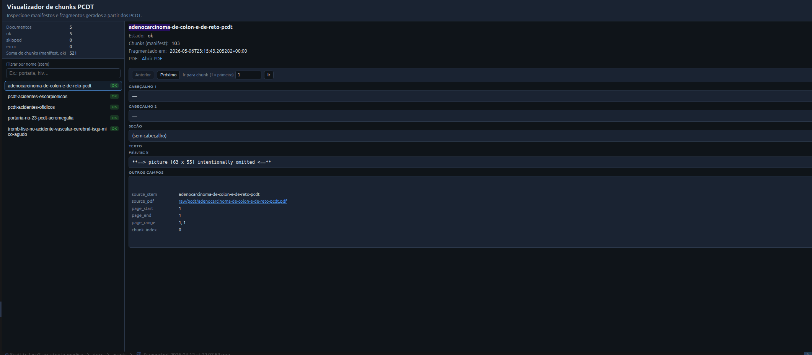

Leitura de tabelas transformada em texto, mas sem estruturação adequada, dificultando a compreensão do conteúdo:

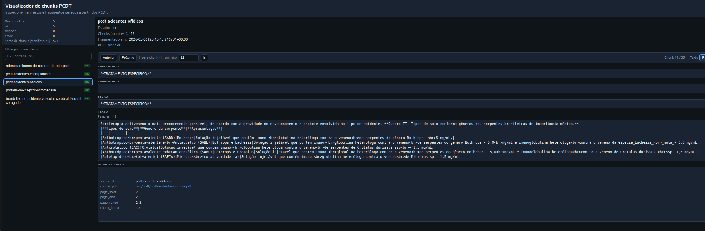

Chunk apenas com texto de rodapé, referência ou assinatura, sem valor para o modelo:

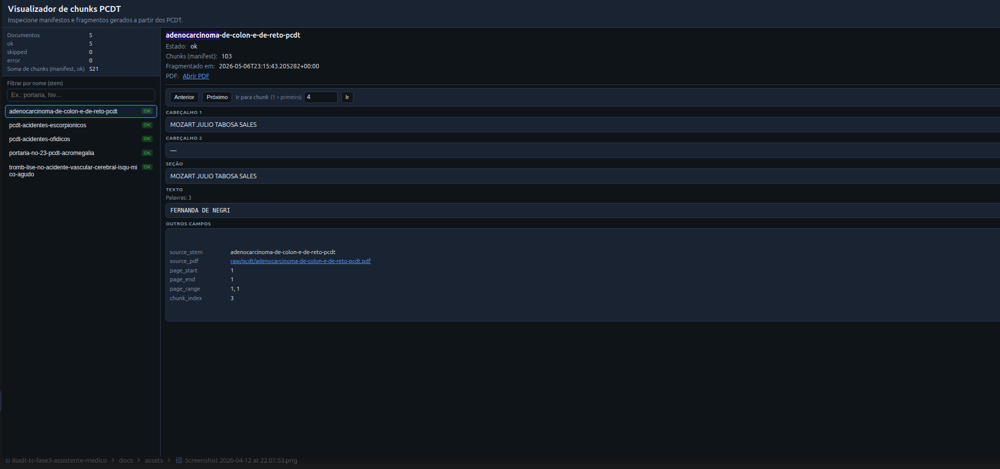

Para tratar estes ruídos, removemos placeholders de imagens, assinatura administrativas, números de páginas remanescentes, normalizar texto (espaços, quebras de linha, acentos), melhorar textos extraído de tabelas, remover cabeçalhos e rodapés repetidos, template de fichas para o preenchimento do paciente ou sobre o paciente, entre outros tratamentos de limpeza.
Essas textos serão salvos em `*.pages.cleaned.jsonl` para serem consumidos pelo `cli_chunk`

### Estratégia para limpeza de texto

Foi adicionada uma etapa de limpeza de texto, que é executada após a extração do Markdown e antes da geração dos chunks. Esta etapa é implementada em `cli_clean.py` e pode ser executada com o comando:
```sh
clean-pcdt-extracted
```
Nesta etapa, o conteúdo extraído é processado para remover ruídos e melhorar a qualidade do texto. As seguintes estratégias de limpeza foram implementadas:
1. **Remoção de placeholders de imagens**: Identificar e remover textos que indicam a presença de imagens, como "Figura 1", "Gráfico 2", etc., que não possuem valor semântico para o modelo.
2. **Limpeza de tabelas**: Melhorar a formatação de textos extraídos de tabelas, identificando padrões de tabulação e organizando o conteúdo de forma mais estruturada
3. **Remoção de rodapés e assinaturas**: Identificar e remover textos que correspondem a rodapés, assinaturas ou informações administrativas que não agregam valor ao modelo.
4. **Normalização de texto**: Realizar normalização de espaços, quebras de linha e acentos para melhorar a legibilidade do texto.
5. **Remoção de cabeçalhos e rodapés repetidos**: Identificar e remover textos que correspondem a cabeçalhos ou rodapés que se repetem em várias páginas do documento.
6. **Remoção de templates de fichas**: Identificar e remover textos que correspondem a templates de fichas para preenchimento de informações do paciente, que não possuem valor semântico para o modelo.
7. **Remoção de números de páginas**: Identificar e remover textos que correspondem a números de páginas remanescentes, que não agregam valor ao modelo.

Os textos limpos estão em `data/processed/pcdt/*.pages.cleaned.jsonl` e serão usados para a geração dos chunks, substituindo os arquivos `.pages.jsonl` gerados na etapa de extração. O processo de chunking permanece o mesmo, mas agora com um texto de melhor qualidade, o que deve resultar em chunks mais relevantes e úteis para o modelo. Além disso, se compará-los com os texto bruto, é possível verificar uma melhoria significativa na qualidade e relevância dos chunks, bem como, é possível perceber o quanto de dados foi removido, pois se mantem o histórico de páginas no arquivo `.pages.cleaned.jsonl` e é possível comparar com o arquivo `.pages.jsonl` para verificar a quantidade de texto removida.


### Chunks após limpeza de texto

Apos a limpeza de texto, os chunks gerados apresentam uma qualidade significativamente melhor, com menos ruídos e informações irrelevantes. Porém, a geração de chunks ainda apresenta desafios, como a identificação correta de seções e cabeçalhos, e atualmente não existe uma implementação de overlap entre os chunks, o que pode resultar em perda de contexto importante para o modelo. A implementação de uma estratégia de overlap, onde parte do conteúdo de um chunk é repetida no próximo chunk, pode ajudar a manter o contexto e melhorar a relevância dos chunks gerados. 

Evidência:

Chunck de acidentes escorpionicos com parte do texto:

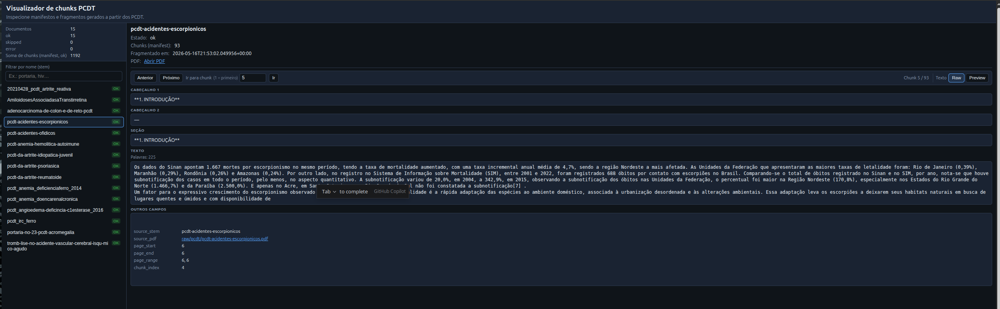

A outra parte do texto com uma quebra abrupta de contexto:

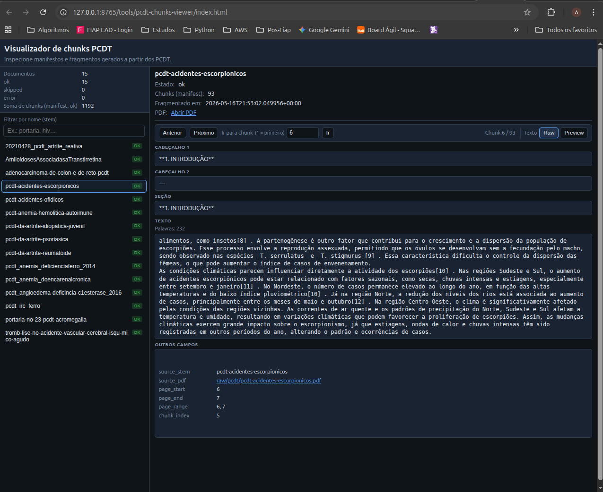

Como constatação do falha que pode ocasionar, fiz a pergunta `"Qual é um fator expressivo no crescimento do escorpionismo em ambiente doméstico?"`, sistema de retrieve retorna o chunk acima, mas a resposta gerada é incompleta e não tem o contexto necessário para ser compreendida, pois a parte do texto que fala sobre o fator expressivo no crescimento do escorpionismo em ambiente doméstico foi cortada, e o modelo (gemma4:e2b fine tunning) não tem acesso a essa informação para gerar uma resposta completa e relevante.

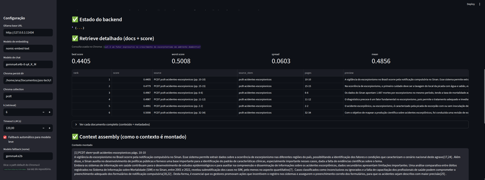

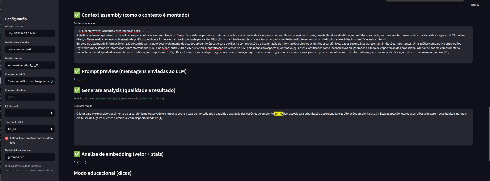


Diante disso, vamos implementar a estratégia de chunks semânticos e evoluir nas explorações.

### Chunks Semânticos

A estratégia de chunks semânticos tem como objetivo identificar os blocos de texto que possuem um mesmo tema ou assunto. Ressaltando que a estratégia de chunking recursivo foi mantida, sendo a escolha de qual método usar feita de forma dinâmica, passando via argumento da execução do CLI.

Porém, essa estratégia ainda estava falhando quando o tamanho do chunk ultrapassava o limite de tokens, e o modelo de embedding não conseguia processar o chunk, mesmo com a redução do limite de tokens para 400. Para resolver esse problema, foi implementada uma estratégia de fallback, onde se o chunk ultrapassar o limite de tokens, ele será dividido em partes menores usando a estratégia de chunking recursivo. O que estava ocasionando em quebrar de textos sem valor semântico completo, conforme imagem abaixo:

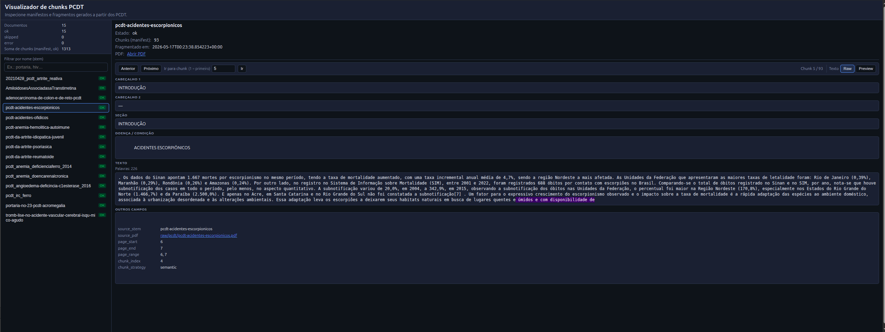

Dessa forma, implementamos a divisão por sentença, usando o `nltk`, e unimos em sentenças até atingir o limite de tokens, garantindo que o chunk gerado tenha um valor semântico completo. Além disso, adicionamento heurísticas para melhorar a coerência textual dos fragmentos.

Conforme imagem abaixo, a busca das informações na base rag foi bem mais limpa, recebendo informações completas e o modelo sem ajuste fino conseguiu responder a mesma pergunta feita anteriormente.

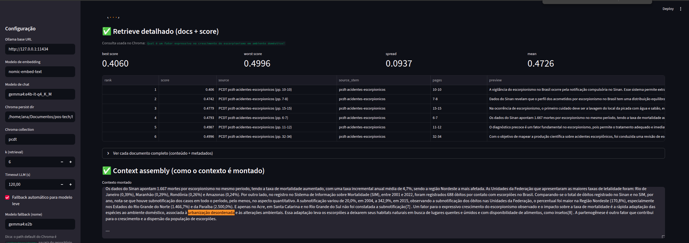

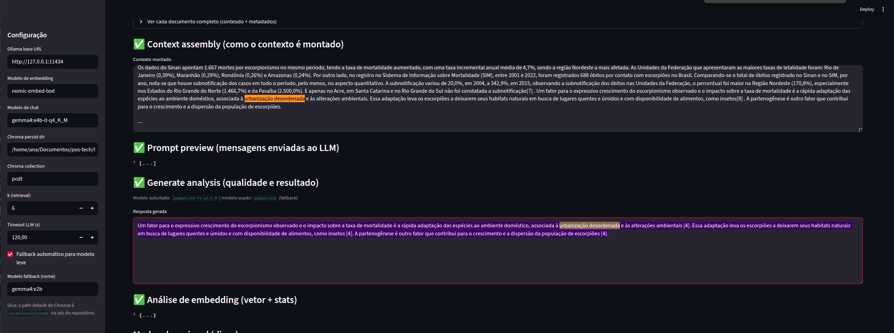


### Enriquecimento de metadados dos chunks e melhoria da segmentação (overlap)

Como apoio ao enriquecimento semântico, o catálogo em formato XLSX da [Comissão Nacional de Incorporação de Tecnologias no Sistema Único de Saúde](https://www.gov.br/conitec/pt-br/midias/dados-em-excel/medicamentos_cid_pcdt_atual-1.xlsx) foi utilizado em duas frentes: como **catálogo de referência clínica do projeto** (detalhado posteriormente) e como **fonte de enriquecimento** durante a ingestão, agregando contexto aos chunks e melhorando a associação entre conteúdos, doenças e termos clínicos.

Os chunks passaram a receber metadados estruturais do documento e do catálogo, como `disease`, `diretriz`, `cid10_codes`, `cid10_descriptions` e `medicamentos`, associados ao conteúdo por correspondência textual e proximidade semântica.

Também foram realizados ajustes no mapeamento de cabeçalhos para preservar melhor a relação entre trechos e suas seções de origem, reduzindo perdas de contexto por quebras de página e inconsistências hierárquicas.

Por fim, foi implementado overlap entre chunks (configurado por `CHUNK_OVERLAP_TOKENS)`, criando continuidade entre fragmentos adjacentes e reduzindo perdas de informação nas fronteiras da segmentação.

Segue um exemplo de chunk após os enriquecimentos e tratamentos realizados:

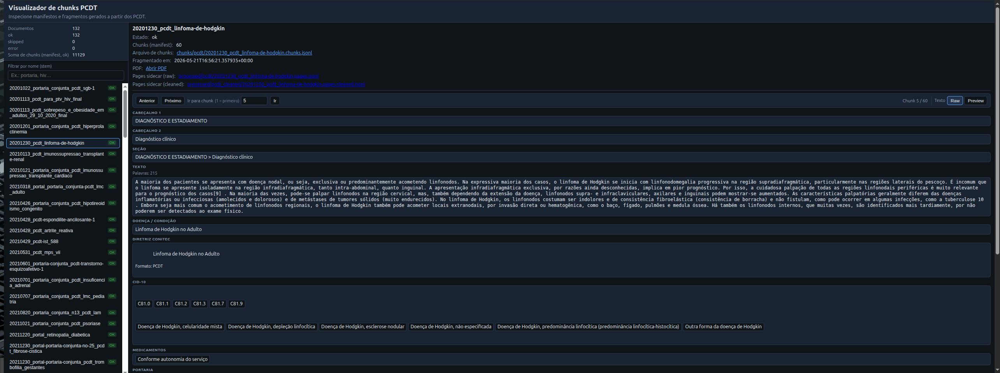

## Cálculo de memória e tamanho de contexto

Tendo em vista a tendência de carregar documentos inteiros na janela de contexto de modelos LLM mais recentes, com modelos suportando janelas acima de 1 milhão de tokens, decidimos investigar o tamanho da nossa base de PCDTs, com 131 protocolos no momento da escrita desta análise.

Criamos o notebook [chroma_llama_token_analysis](../llm/fine-tuning/chroma_llama_token_analysis.ipynb) para obter as respostas para perguntas como:

* Quantos tokens Llama3.2:3B (4bit / Q4_K_M) nossos chunks ocupam? \
R: 4.249.631 tokens Llama (em 15,541 chunks)

* Quantos PCDTs caberiam inteiros numa janela de contexto de 120k tokens? (um documento por vez) \
R: 130 (ou seja, apenas 2 não cabem inteiros)

* Quantos *PCDTs* tem chunks que passam do limite configurado de tokens? \
R: 52 - com o maior deles ocupando 2224 tokens, o que indica um erro no processo de fragmentação

* E quantos *chunks* passam do limite configurado? \
R: 3955 chunks com mais de 400 tokens Llama

* Qual contexto máximo para 16GB de VRAM? \
R: ~120k em quantização 4bit / ~76k para CUDA 16bit

* Quantos chunks cabem nesse contexto no pior cenário? (maiores chunks sendo usados) \
R: <121 para 4bit / <63 para CUDA 16bit (sem considerar system prompt e mensagens trocadas)


# Fine Tuning

Interagindo com o assistente usando Gemma4 sem fine-tuning, as respostas tem um tom inconsistente - às vezes muito formal, às vezes muito distante ("com os dados fornecidos"). Parte do problema foi resolvido mudando as instruções do agente e indicando que foi o próprio agente que iniciou a pesquisa nos documentos PCDT e ele deve apenas continuar a responder a mensagem com base nos resultados. Além do mais, os documentos PCDT são muito específicos e não agregam tanto no conhecimento do agente quanto um dataset destinado a conhecimentos médicos.

## Dataset - MedQuAD

É aqui que entra o fine-tuning do modelo com o MedQuAD, como forma tanto de melhorar o tom de resposta do modelo quanto seu repertório técnico em medicina.
O MedQuAD é hospedado em um [repositório GitHub](https://github.com/abachaa/MedQuAD), separado em pastas para as diferentes fontes de perguntas e respostas.

Apesar da vasta quantidade de pares de perguntas e respostas, há seções sem respostas ou com respostas incorretas ou incompletas. Os autores, no entanto, realizaram uma avaliação manual das perguntas do [TREC-2017 LiveQA medical task](https://github.com/abachaa/LiveQA_MedicalTask_TREC2017/tree/master/TestDataset) e classificaram as respostas do próprio dataset em: 1-Incorrect, 2-Related, 3-Incomplete, and 4-Excellent.
O resultado desta classificação foi disponibilizado no arquivo [QA-TestSet-LiveQA-Med-Qrels-2479-Answers.zip](https://github.com/abachaa/MedQuAD/blob/master/QA-TestSet-LiveQA-Med-Qrels-2479-Answers.zip), que foi manualmente extraído para a pasta `llm/fine-tuning/assets` do repositório deste trabalho.

## Tradução do dataset

Criado o notebook [data-prep.ipynb](../llm/fine-tuning/data-prep.ipynb) para tratar e traduzir o dataset filtrado, que resultou em 141 pares de perguntas e respostas avaliadas como excelente e então traduzidas usando o modelo Gemma4:E4B. Foi constatado também uma certa inconsistência entre as respostas devido ao processo que os autores usaram para a extração: scraping de websites informativos de agências de saúde. Em alguns casos, foi observado que o modelo Gemma4:E4B forneceu respostas mais precisas e pertinentes do que as presentes no dataset. O Gemma4:E4B foi executado localmente usando Ollama e precisou ter o tamanho do contexto aumentado para 8192 para dar conta de respostas mais longas. Em um MacBook M4 Pro com 26GB, o comando `OLLAMA_CONTEXT_LENGTH=8192 OLLAMA_NUM_PARALLEL=4 ollama serve` se mostrou satisfatório.

O ideal seria escolher um dataset mais consistente e robusto, e com linguajar mais próximo do que se espera de uma interação direta com o conteúdo (conversa) ao invés de expositiva (lista de FAQs, seções de artigos ou mesmo artigos inteiros). Para o propósito deste trabalho acadêmico, entretanto, optamos por continuar com o dataset sugerido.

Criado o notebook [data-prep.ipynb](../llm/fine-tuning/data-prep.ipynb) para tratar e traduzir o dataset filtrado.

## Execução do Fine Tuning

O fine tune inicial foi executado via unsloth em uma GPU T4 do Google Colab. ([fine-tuning_colab_medquad.ipynb](../llm/fine-tuning/fine-tuning_colab_medquad.ipynb))
Em uma tentativa de deixar as mensagens o mais próxima do cenário onde são utilizadas, foi usado o `ChatPromptTemplate` para gerar as mensagens formatadas para o treinamento. Para o treinamento, foi constatado que uma única época não produziu uma alteração satisfatória, e com 3 épocas tivemos over fitting, onde ao executar a inferência do modelo ajustado com uma nova pergunta, o modelo halucinou e prodiziu mensagens inconsistentes.

Para contornar a limitação de uso do Google Colab e acelerar o tempo de iteração, foi criado um novo notebook para executar o fine tune localmente em Apple Silicon ([fine-tuning_apple-silicon_medquad.ipynb](../llm/fine-tuning/fine-tuning_apple-silicon_medquad.ipynb)). Infelizmente, unsloth ainda não suporta este ambiente e por isso foi usado `mlx-tune` no lugar, que mantém a mesma interface/API/contrato e delega o treino para `mlx-lm`, otimizado para Apple Silicon.

### Resultados preliminares

Feito isso, foi constatado que o uso do `ChatPromptTemplate` "bagunçou a cabeça" do modelo Llama3.2:3B-Instruct, que na verdade já foi pré-treinado com um padrão. Com este template, em muitos casos o modelo respondia com perguntas utilizadas durante o treinamento, ao invés de responder diretamente. Este problema foi contornado ao usar `tokenizer.apply_chat_template`.

Outro problema foi a inconsistência no tamanho das respostas do dataset, que gerou truncamento durante o treinamento. Com este truncamento, o modelo viu vários exemplos sem o token de fim de geração (`<|eot_id|>`, para Llama3+) e resultou em gerações/respostas com repetição de frases até completar `max_seq_length`/tamanho do contexto. Neste cenário, foi identificado que o `mlx-tune` não passa corretamente o tamanho de contexto para o módulo `mlx-lm`, limitando o uso da lib com 2048 tokens.

## Nova estratégia - nossas conversas

Considerando que gemma4:e4b gerou respostas mais precisas e concisas do que as presentes no dataset, decidimos usar o modelo llama3.2:3b como base, ajustado com conversas tidas com o assistente usando gemma4.

A interface de chat foi melhorada para permitir que os usuários classifiquem as respostas como positivas ou negativas, além de exibir conversas anteriores entre o mesmo médico e paciente e também permitir gerar novamente a última resposta do assistente. Assim, usando o MedQuAD mais como uma referência sobre o que perguntar e o que esperar, além de verificações de perguntas sobre o conteúdo de alguns dos PCDTs disponíveis, criamos nossa própria base de conversas com curadoria própria.

Enquanto isto acontecia, outras features passaram a depender mais de integração com LLM, como reescrita de pergunta usando RAG, rerank de resultados RAG, avaliação de segurança da resposta e reescrita ("guardrail"). Para coletar as conversas e as interações relacionadas ao processamento das respostas, criamos o notebook [export-positive-conversations.ipynb](../llm/fine-tuning/export-positive-conversations.ipynb).

O resultado é uma coleção de entradas e saídas da LLM anonimizadas, o nosso dataset de treinamento: [`sft_positive_conversations.jsonl`](../llm/fine-tuning/assets/sft_positive_conversations.jsonl)

## Treinamento com as conversas

Foi criado o notebook [fine-tuning_apple-silicon_assistente.ipynb](../llm/fine-tuning/fine-tuning_apple-silicon_assistente.ipynb) para gerar a primeira versão do modelo ajustado e fazer a validação inicial. Desta vez, foi usado `mlx-lm` diretamente para contornar a limitação descrita na versão com MedQuAD (`max_seq_length`).

Entretanto, para exportar um formato compatível com Ollama e quantizado em 4bits para execução em placas que não sejam Apple Silicon, o padrão `unsloth` em Google Colab foi o escolhido e elaborado mais a fundo.

Em [fine-tuning_colab_assistente.ipynb](../llm/fine-tuning/fine-tuning_colab_assistente.ipynb), fazemos o fine-tuning LoRA do modelo usando nosso dataset:
- com um `max_seq_length` de 9000 tokens para que a conversa mais longa não seja truncada,
- usamos as configurações do [exemplo oficial de fine-tuning](https://colab.research.google.com/github/unslothai/notebooks/blob/main/nb/Llama3.2_(1B_and_3B)-Conversational.ipynb#scrollTo=vhXv0xFMGNKE) do unsloth
- usamos o modelo base já quantizado: `unsloth/llama-3.2-3b-instruct-unsloth-bnb-4bit`
- aplicando o chat template do Llama3.2, com os devidos tokens especiais
- exportamos o modelo quantizado em GGUF para Google Drive e HuggingFace

### Resultados iniciais e ajuste

O resultado visto no Notebook pareceu promissor, mas na prática, testando com `ollama run hf.co/leanseefeld/assistente-medico-llama32-3b-q4km:Q4_K_M`, a degradação de performance do modelo foi notável. Vimos o modelo responder em espanhol para perguntas em português, usar formatadores de data desnecessariamente e, mais notoriamente, esquecer informações básicas, como datas de acontecimentos históricos. Na execução com o nosso grafo LangGraph - com o system prompt e contexto muito parecido ao usado em alguns treinamentos - o modelo passou a se repetir e inventar trechos PCDT ou listas, e diversas vezes não foi capaz de chegar ao fim da geração.

Outro problema em potencial é a exportação GGUF quantizada. Logo após o treinamento, ainda no mesmo notebook, o modelo responde adequadamente às perguntas de teste. É depois de quantizar [um modelo já quantizado] que fica muito evidente a perda de performance.

Tudo indica para esquecimento catastrófico do modelo.

Para contornar o problema, foi experimentado outra configuração mais conservadora, com lora rank, camadas afetadas e taxa de aprendizagem reduzidas (`r=8, lora_alpha=16, learning_rate=1e-4`), e dessa vez treinando no modelo não quantizado (FP16), antes de fazer a quantização. Foi também habilitado o masking de atenção do prompt, fazendo com que o modelo aprenda a prever a resposta correta para a pergunta, e não prever o próprio prompt.

Os resultados foram melhores, com menos alucinações e repetições intermináveis, porém ainda houve uma significativa degradação de desempenho do modelo e a ocasional resposta interminável, especialmente em nós que usam prompts especiais para RAG.

## Resultados finais

Para perguntas não vistas antes, o modelo tendeu a trazer o resumo do caso do paciente antes de dar uma resposta vaga e sem valor ("para saber mais, consulte um especialista"). Para perguntas presentes no treinamento, usou formatos [Observação][Exame][Reavaliação] em listas onde não deveria usar, e respondeu com "Ações sugeridas" sem que a pergunta exigisse isso. Para perguntas de conhecimento geral (fora do domínio de treinamento), o modelo tentou fazer associações com o paciente em questão ("não há um evento X associado com o paciente João"). Em alguns casos, respondeu corretamente a pergunta, em outros, se recusou a responder ("A pergunta do médico parece ser uma curiosidade ou um exercício de humor. Não há nenhuma ação clínica sugerida para essa pergunta").

No geral, quase não desviou do padrão visto no treinamento para as mesmas perguntas iniciais ("Resuma o caso clínico atual", "Qual a ação sugerida?", "Quais exames estão pendentes?"), mas ficou preso a respostas vistas no treinamento para perguntas de acompanhamento (trazendo ações sugeridas quando perguntado "Que outros exames solicitar?").

O resultado ainda não é satisfatório para o uso em um ambiente real ou sequer de treinamento médico, mas indica evolução perante a configuração anterior de SFT.

## Melhorias possíveis

Dado mais tempo, os próximos passos para melhorar o modelo seriam:
- incluir mais exemplos de conversas com perguntas mais diversas;
- incluir exemplos de conversas não relacionadas com o domínio na aplicação (para evitar esquecimento);
- verificar a ordem em que os exemplos são apresentados ao modelo (exemplos apresentados primeiro tem maior influência que os últimos); e
- experimentar com parâmetros de ajuste ainda mais moderados, dependendo do tamanho do dataset.

## Resolução clínica e expansão de consultas orientada por catálogo

Foi implementada uma camada de entendimento clínico orientada pelo catálogo CONITEC (mencionado acima) para melhorar a recuperação dos PCDTs. Inicialmente, as consultas passam por uma etapa de classificação de intenção clínica (como critérios de inclusão, exclusão, diagnóstico, tratamento, monitoramento e medicamentos), utilizando técnicas leves de similaridade textual, sem dependência de LLM.

A resolução de entidades clínicas foi integrada ao spaCy/medSpaCy em português, com fallback para o catálogo local quando os modelos não estão disponíveis.

A reescrita e expansão de consultas foram centralizadas em serviços dedicados do backend. O fluxo combina reescrita conversacional com expansão estruturada baseada no catálogo CONITEC, preservando termos clínicos relevantes (como siglas e CIDs) para evitar perda de contexto durante consultas com histórico.

Como resultado, a consulta passa a gerar uma estrutura de termos clínicos (`structured_terms`) contendo sinais como doença, diretriz, CID-10, medicamentos e intenção clínica, utilizada posteriormente por filtros e reranking.

Na recuperação, documentos compatíveis com a diretriz ou doença identificada recebem prioridade, enquanto documentos de contextos clínicos diferentes podem ser penalizados, reduzindo respostas baseadas em PCDTs incorretos e aumentando a precisão do RAG.

Um exemplo de consulta reescrita e expandida, com termos clínicos extraídos, pode ser visto abaixo, em que fizemos a pergunta "Quais são as medicações para o tratamento da artrite reumatóide?" e o sistema extraiu a intenção clínica de "FÁRMACOS" e a doença "Artrite Reumatoide", além de reescrever a consulta para incluir termos relacionados (parte dos termos não estão visíveis na imagem, pela própria extensão do documento):

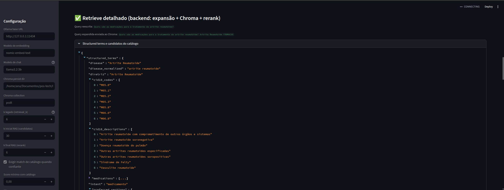

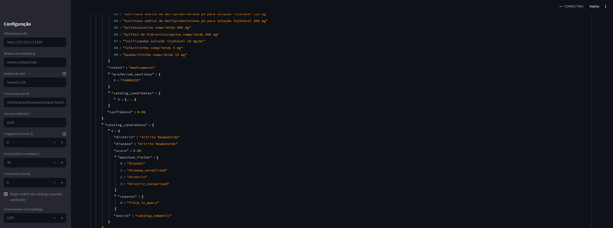

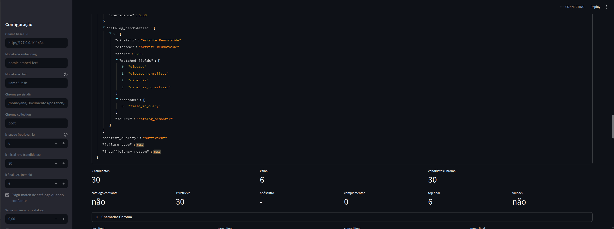


## Refatoração do fluxo LangGraph

O fluxo RAG do backend foi refatorado para uma arquitetura mais clara e modular, baseada em nós conceituais do LangGraph. A orquestração passou a seguir o encadeamento principal `router → rewrite → retrieve → rerank → generate → guardrail`, separando melhor as responsabilidades de decisão, reescrita da consulta, recuperação, validação do contexto, geração e verificação final da resposta.

O nó `generate` foi unificado: em vez de manter nós separados para resposta direta, resposta com contexto e contexto insuficiente, o grafo passou a utilizar um único nó de geração. A estratégia aplicada é definida pelo campo `generation_mode` no estado do grafo, com os modos `direct_answer`, `grounded_answer` e `insufficient_context`. Isso simplifica o fluxo, reduz duplicidade de arestas e mantém o `guardrail` como etapa final comum para todas as respostas.


```
          +-----------+       
          | __start__ |       
          +-----------+       
                 *            
                 *            
                 *            
            +--------+        
            | router |        
            +--------+        
           ..         ..      
         ..             ..    
        .                 ..  
+---------+                 . 
| rewrite |                 . 
+---------+                 . 
      *                     . 
      *                     . 
      *                     . 
+----------+                . 
| retrieve |                . 
+----------+                . 
      *                     . 
      *                     . 
      *                     . 
 +--------+                 . 
 | rerank |               ..  
 +--------+             ..    
           ..         ..      
             ..     ..        
               .   .          
           +----------+       
           | generate |       
           +----------+       
                 *            
                 *            
                 *            
          +-----------+       
          | guardrail |       
          +-----------+       
                 *            
                 *            
                 *            
            +---------+       
            | __end__ |       
            +---------+       

```

## Configurações avançadas do RAG

Também foram expostas configurações no backend e no RAG Inspector (`llm/scripts/rag_inspector_app.py`) para facilitar testes, depuração e ajustes finos do pipeline. Entre elas estão `rag_max_retrieve_attempts`, que controla o número máximo de tentativas de recuperação; `rag_use_llm_rerank`, que habilita o reranking com LLM; e `rag_llm_rerank_top_n`, que define quantos candidatos são enviados para essa etapa.

Além disso, o projeto passou a permitir configuração do timeout de geração (`llm_stream_timeout_s`), do número inicial de candidatos recuperados (`rag_retrieve_candidates_k`), do número final de documentos usados no prompt (`rag_retrieve_final_k`) e da exigência de fonte para respostas clínicas (`rag_require_source_for_clinical_answer`). Essas opções tornam o comportamento do RAG mais controlável e observável durante experimentos e validações.

----------

# Extensão

Após a entrega do trabalho, decidi revisitar o pipeline RAG para remover a complexidade e usar melhor as ferramentas existentes.

Pretendo melhorar a vizualização e teste da pipeline RAG, potencialmente criando um sub agente dedicado a pesquisa de documentos.

Pretendo remover as heurísticas de expansão de queries e fallbacks - o serviço dependerá de um servidor de inferência estável para gerar respostas com mais robustez.

Devo avaliar também se a segmentação e recuperação de trechos permite reconstruir adequadamente partes do documento consultado. Explorar a expansão para trechos vizinhos de resultados retornados.

Para o nó de geração de termos de busca, garantir que funcione para retornar múltiplas queries. Implementar o rankeamento das diferentes consultas considerando a similaridade com o vetor usado na busca - apenas se esse rankeamento já for implementado pelo chrome-db. Explorar _chain of though_ para melhorar os resultados do modelo.

Futuramente, revisitar o fine tuning. Incluir uma maneira mais objetiva de avaliar o modelo, como recall e accuracy. Então, produzir mais exemplos de qualidade para cada categoria de instrução esperada para o modelo ajustado - avaliando incluir saídas do _chain of thought_ onde for usado (como na geração de queries). Potencialmente, usar modelo superior (gemma4, claude ou chatgpt) para gerar exemplos de perguntas e respostas adequadas  para o fine tuning.